# Dark Regenaissance: Implementation Plan & Task Breakdown
## Comprehensive Project Execution Document

---

## Table of Contents

1. [Project Overview](#1-project-overview)
2. [Phase Overview & Timeline](#2-phase-overview--timeline)
3. [Phase 1: Foundation & Infrastructure](#3-phase-1-foundation--infrastructure)
4. [Phase 2: Core Web Experience](#4-phase-2-core-web-experience)
5. [Phase 3: AI Voice Development](#5-phase-3-ai-voice-development)
6. [Phase 4: Social Integration](#6-phase-4-social-integration)
7. [Phase 5: Testing & Refinement](#7-phase-5-testing--refinement)
8. [Phase 6: Launch & Monitoring](#8-phase-6-launch--monitoring)
9. [Phase 7: Post-Launch Optimization](#9-phase-7-post-launch-optimization)
10. [Dependency Matrix](#10-dependency-matrix)
11. [Risk Mitigation Tasks](#11-risk-mitigation-tasks)
12. [Quality Assurance Checklist](#12-quality-assurance-checklist)
13. [Rollout Strategy](#13-rollout-strategy)

---

## 1. Project Overview

### 1.1 Project Scope

**Deliverables**:
- Web application with 3D visualization and chat interface
- Twitter integration (manual posting)
- Telegram bot (full-featured)
- File-based data persistence
- Comprehensive system prompt for AI voice

**Budget Constraints**:
- Target: <$50/month total operating cost
- Free tier services: Vercel, Twitter API, Telegram
- Paid: Gemini API only (~$20-40/month)

### 1.2 Success Criteria

**Technical**:
- [ ] Web app loads in <3s
- [ ] AI responses stream in <2s
- [ ] 3D scene runs at 60fps desktop, 30fps mobile
- [ ] Zero downtime deployment
- [ ] 99%+ uptime

**Functional**:
- [ ] Users can have coherent multi-turn conversations
- [ ] AI voice is distinctive and consistent
- [ ] Twitter posting works reliably
- [ ] Telegram bot responds in groups and DMs
- [ ] Admin can monitor costs and usage

---

## 2. Phase Overview & Timeline

### 2.1 Phase Summary

| Phase | Duration | Effort | Key Deliverable | Dependencies |
|-------|----------|--------|-----------------|--------------|
| **Phase 1: Foundation** | Week 1 (5 days) | 30 hrs | Project scaffolding, basic API | None |
| **Phase 2: Web Experience** | Week 2 (5 days) | 35 hrs | 3D scene + terminal UI | Phase 1 complete |
| **Phase 3: AI Voice** | Week 3-4 (10 days) | 25 hrs | System prompt + refinement | Phase 1, 2 complete |
| **Phase 4: Social Integration** | Week 5 (5 days) | 20 hrs | Twitter + Telegram bots | Phase 1, 3 complete |
| **Phase 5: Testing** | Week 6 (5 days) | 25 hrs | QA, bug fixes, optimization | Phase 2, 3, 4 complete |
| **Phase 6: Launch** | Week 7 (3 days) | 15 hrs | Deployment, monitoring setup | All phases complete |
| **Phase 7: Post-Launch** | Ongoing | Variable | Iteration, optimization | Phase 6 complete |

**Total Timeline**: 7 weeks to launch  
**Total Effort**: ~150 hours

### 2.2 Critical Path

```
Phase 1 (Foundation)
    ↓
Phase 2 (Web UI) ──→ Phase 3 (AI Voice)
    ↓                        ↓
    └────────→ Phase 4 (Social) ──→ Phase 5 (Testing) ──→ Phase 6 (Launch)
```

**Critical Path Tasks** (must complete on schedule):
- 1.1.1: Project initialization
- 1.2.1: Next.js setup
- 1.4.1: Gemini integration
- 2.1.1: Three.js scene foundation
- 2.2.1: Terminal component
- 3.1.1: System prompt v1.0
- 5.1.1: End-to-end testing
- 6.1.1: Production deployment

---

## 3. Phase 1: Foundation & Infrastructure

**Goal**: Set up development environment, project structure, and core backend services  
**Duration**: Week 1 (5 days, ~30 hours)  
**Dependencies**: None

### 3.1 Project Initialization

#### Task 1.1.1: Repository Setup ⭐ CRITICAL PATH
**Effort**: 1 hour  
**Dependencies**: None  
**Assignee**: Developer

**Subtasks**:
- [ ] 1.1.1.1: Create GitHub repository (private)
  - Initialize with .gitignore (Node.js template)
  - Add README.md with project description
  - Set up branch protection (require PR for main)
- [ ] 1.1.1.2: Clone repository locally
  ```bash
  git clone https://github.com/your-org/darkregenasence.git
  cd darkregenasence
  ```
- [ ] 1.1.1.3: Initialize npm project
  ```bash
  npm init -y
  ```
- [ ] 1.1.1.4: Set up Git hooks (Husky)
  ```bash
  npm install -D husky
  npx husky init
  ```

**Acceptance Criteria**:
- Repository accessible by team
- Local clone successful
- Git hooks run on commit

**Related Tasks**: 1.1.2, 1.1.3

---

#### Task 1.1.2: Environment Configuration
**Effort**: 1 hour  
**Dependencies**: 1.1.1  
**Assignee**: Developer

**Subtasks**:
- [ ] 1.1.2.1: Create `.env.example` file
  ```bash
  # See Technical Architecture Doc section 18.1
  NEXT_PUBLIC_SITE_URL=https://darkregenasence.xyz
  GEMINI_API_KEY=your_key_here
  # ... etc
  ```
- [ ] 1.1.2.2: Add `.env.local` to `.gitignore`
- [ ] 1.1.2.3: Copy `.env.example` to `.env.local`
- [ ] 1.1.2.4: Document environment variables in README.md

**Acceptance Criteria**:
- `.env.example` committed to git
- `.env.local` ignored by git
- All required env vars documented

**Related Tasks**: 1.3.1 (will add actual API keys)

---

#### Task 1.1.3: Development Tools Setup
**Effort**: 1 hour  
**Dependencies**: 1.1.1  
**Assignee**: Developer

**Subtasks**:
- [ ] 1.1.3.1: Install ESLint
  ```bash
  npm install -D eslint @typescript-eslint/parser @typescript-eslint/eslint-plugin
  ```
- [ ] 1.1.3.2: Create `.eslintrc.json`
  ```json
  {
    "extends": ["next/core-web-vitals"],
    "rules": {
      "no-console": "warn"
    }
  }
  ```
- [ ] 1.1.3.3: Install Prettier
  ```bash
  npm install -D prettier eslint-config-prettier
  ```
- [ ] 1.1.3.4: Create `.prettierrc`
  ```json
  {
    "semi": true,
    "singleQuote": true,
    "tabWidth": 2,
    "trailingComma": "es5"
  }
  ```
- [ ] 1.1.3.5: Add VSCode settings (`.vscode/settings.json`)
  ```json
  {
    "editor.formatOnSave": true,
    "editor.defaultFormatter": "esbenp.prettier-vscode"
  }
  ```

**Acceptance Criteria**:
- Linting runs without errors
- Code auto-formats on save (VSCode)
- Git hook prevents commits with lint errors

**Related Tasks**: 5.2.1 (code quality checks)

---

### 3.2 Next.js Application Setup

#### Task 1.2.1: Next.js Project Creation ⭐ CRITICAL PATH
**Effort**: 2 hours  
**Dependencies**: 1.1.1, 1.1.2  
**Assignee**: Frontend Developer

**Subtasks**:
- [ ] 1.2.1.1: Create Next.js app
  ```bash
  npx create-next-app@latest . --typescript --tailwind --app --no-src-dir
  ```
- [ ] 1.2.1.2: Verify development server runs
  ```bash
  npm run dev
  # Should open on http://localhost:3000
  ```
- [ ] 1.2.1.3: Install additional dependencies
  ```bash
  npm install three @react-three/fiber @react-three/drei
  npm install @google/generative-ai
  npm install zod
  ```
- [ ] 1.2.1.4: Configure `next.config.js`
  ```javascript
  module.exports = {
    compress: true,
    experimental: {
      optimizePackageImports: ['three', '@react-three/fiber'],
    },
  };
  ```
- [ ] 1.2.1.5: Update `tsconfig.json` with path aliases
  ```json
  {
    "compilerOptions": {
      "paths": {
        "@/*": ["./*"]
      }
    }
  }
  ```

**Acceptance Criteria**:
- Development server runs at localhost:3000
- TypeScript compilation works
- Tailwind CSS loads
- Path aliases work (@/components/...)

**Related Tasks**: 2.1.1, 2.2.1

---

#### Task 1.2.2: Project Structure Creation
**Effort**: 1 hour  
**Dependencies**: 1.2.1  
**Assignee**: Frontend Developer

**Subtasks**:
- [ ] 1.2.2.1: Create directory structure
  ```bash
  mkdir -p app/api/chat
  mkdir -p app/api/admin/{tweet,reply}
  mkdir -p app/api/insights/random
  mkdir -p app/api/telegram/webhook
  mkdir -p app/api/health
  mkdir -p app/admin
  mkdir -p components/{Scene3D,Terminal,Admin,Layout}
  mkdir -p lib/{services,repositories,ai,twitter,telegram,middleware,utils,config,analytics}
  mkdir -p hooks
  mkdir -p types
  mkdir -p data/{conversations/{web,telegram},tweets,insights}
  mkdir -p public/models
  mkdir -p scripts
  mkdir -p __tests__
  ```
- [ ] 1.2.2.2: Create placeholder files
  ```bash
  touch app/api/chat/route.ts
  touch components/Scene3D/index.tsx
  touch components/Terminal/index.tsx
  touch lib/services/ai.service.ts
  touch types/index.ts
  ```
- [ ] 1.2.2.3: Add README files to key directories
  ```bash
  echo "# API Routes" > app/api/README.md
  echo "# Components" > components/README.md
  echo "# Services" > lib/services/README.md
  ```

**Acceptance Criteria**:
- All directories exist
- Structure matches Technical Architecture Doc section 17
- No TypeScript compilation errors

**Related Tasks**: All subsequent tasks depend on this structure

---

#### Task 1.2.3: Tailwind Configuration
**Effort**: 1 hour  
**Dependencies**: 1.2.1  
**Assignee**: Frontend Developer

**Subtasks**:
- [ ] 1.2.3.1: Update `tailwind.config.js`
  ```javascript
  module.exports = {
    content: [
      './app/**/*.{js,ts,jsx,tsx,mdx}',
      './components/**/*.{js,ts,jsx,tsx,mdx}',
    ],
    theme: {
      extend: {
        colors: {
          'dark-bg': '#0a0a12',
          'dark-green': '#1a2b1a',
          'mycelium': '#2d5f3f',
          'mycelium-bright': '#4a7c4f',
          'terminal-green': '#00ff41',
        },
        fontFamily: {
          mono: ['IBM Plex Mono', 'Courier New', 'monospace'],
        },
      },
    },
    plugins: [],
  };
  ```
- [ ] 1.2.3.2: Update `app/globals.css`
  ```css
  @tailwind base;
  @tailwind components;
  @tailwind utilities;
  
  @layer base {
    body {
      @apply bg-dark-bg text-terminal-green font-mono;
    }
  }
  ```
- [ ] 1.2.3.3: Download and add IBM Plex Mono font
  - Download from Google Fonts
  - Add to `public/fonts/`
  - Configure font in `app/layout.tsx`

**Acceptance Criteria**:
- Custom colors available in Tailwind
- Font loads correctly
- Dark theme applies globally

**Related Tasks**: 2.2.2 (terminal styling)

---

### 3.3 Data Layer Setup

#### Task 1.3.1: File-Based Storage Implementation
**Effort**: 2 hours  
**Dependencies**: 1.2.2  
**Assignee**: Backend Developer

**Subtasks**:
- [ ] 1.3.1.1: Create TypeScript interfaces (`types/index.ts`)
  ```typescript
  export interface Message {
    role: 'user' | 'assistant';
    content: string;
    timestamp: string;
    tokens?: number;
  }
  
  export interface Conversation {
    id: string;
    platform: 'web' | 'telegram' | 'twitter';
    platformId?: string;
    messages: Message[];
    createdAt: string;
    updatedAt: string;
    metadata?: Record<string, any>;
  }
  
  // ... other interfaces from Tech Arch Doc section 8.2
  ```
- [ ] 1.3.1.2: Implement `ConversationRepository` (`lib/repositories/conversation.repository.ts`)
  - Refer to Technical Architecture Doc section 8.3
  - Implement: save(), load(), list(), delete()
- [ ] 1.3.1.3: Create initial data files
  ```bash
  echo "[]" > data/insights/curated.json
  echo '{"month":"2025-01","reads":0,"writes":0,"deletes":0}' > data/tweets/usage.json
  echo "[]" > data/tweets/posted.json
  ```
- [ ] 1.3.1.4: Add data/ to git (but not individual conversation files)
  ```bash
  # In .gitignore
  data/conversations/**/*.json
  !data/conversations/.gitkeep
  ```

**Acceptance Criteria**:
- All TypeScript interfaces defined
- ConversationRepository passes unit tests
- Data directories initialize properly
- Git tracks structure but not conversation data

**Related Tasks**: 1.3.2, 3.2.1

---

#### Task 1.3.2: Cache Service Implementation
**Effort**: 2 hours  
**Dependencies**: 1.3.1  
**Assignee**: Backend Developer

**Subtasks**:
- [ ] 1.3.2.1: Implement `CacheService` (`lib/services/cache.service.ts`)
  - Refer to Technical Architecture Doc section 6.3.3
  - In-memory Map with TTL
  - Automatic cleanup every 5 minutes
- [ ] 1.3.2.2: Export singleton instance
  ```typescript
  export const cacheService = new CacheService();
  ```
- [ ] 1.3.2.3: Write unit tests
  ```typescript
  // __tests__/lib/services/cache.service.test.ts
  describe('CacheService', () => {
    it('should store and retrieve values', () => {
      cacheService.set('key', 'value', 60);
      expect(cacheService.get('key')).toBe('value');
    });
    
    it('should expire values after TTL', async () => {
      cacheService.set('key', 'value', 1);
      await sleep(1100);
      expect(cacheService.get('key')).toBeNull();
    });
  });
  ```
- [ ] 1.3.2.4: Add cache statistics method
  ```typescript
  getStats(): { size: number; keys: string[] }
  ```

**Acceptance Criteria**:
- Cache service stores/retrieves values
- TTL expiration works correctly
- Automatic cleanup prevents memory leaks
- Unit tests pass

**Related Tasks**: 1.4.3 (use in API routes)

---

### 3.4 AI Integration Foundation

#### Task 1.4.1: Gemini API Setup ⭐ CRITICAL PATH
**Effort**: 2 hours  
**Dependencies**: 1.2.1, 1.1.2  
**Assignee**: Backend Developer

**Subtasks**:
- [ ] 1.4.1.1: Obtain Gemini API key
  - Visit https://ai.google.dev/
  - Create account / project
  - Generate API key
  - Add to `.env.local`: `GEMINI_API_KEY=...`
- [ ] 1.4.1.2: Create AIProvider interface (`lib/ai/providers/base.ts`)
  ```typescript
  export interface AIProvider {
    generate(
      userMessage: string,
      context: Message[]
    ): Promise<AsyncIterable<string>>;
    
    estimateCost(tokens: number): number;
    
    getModelInfo(): {
      name: string;
      inputCostPer1M: number;
      outputCostPer1M: number;
    };
  }
  ```
- [ ] 1.4.1.3: Implement `GeminiProvider` (`lib/ai/providers/gemini.provider.ts`)
  - Refer to Technical Architecture Doc section 7.2
  - Use `gemini-2.0-flash-exp` model
  - Implement streaming generation
- [ ] 1.4.1.4: Test Gemini connection
  ```bash
  npm run test-gemini
  ```

**Acceptance Criteria**:
- Gemini API key works
- GeminiProvider generates responses
- Streaming works correctly
- Cost estimation function implemented

**Related Tasks**: 1.4.2, 3.1.1

---

#### Task 1.4.2: System Prompt Foundation
**Effort**: 3 hours  
**Dependencies**: 1.4.1  
**Assignee**: Product Owner + Developer

**Subtasks**:
- [ ] 1.4.2.1: Create `lib/ai/prompts.ts`
- [ ] 1.4.2.2: Write comprehensive system prompt v0.1
  - Refer to PRD and Technical Architecture Doc section 7.3
  - Include: Identity, Voice, Core Beliefs, Communication Patterns
  - Add 5-10 example Q&As
  - Target: 3000-4000 tokens
- [ ] 1.4.2.3: Implement prompt versioning
  ```typescript
  export const PROMPT_VERSIONS = {
    'v0.1': SYSTEM_PROMPT_V01,
  };
  
  export function getPrompt(version = 'v0.1'): string {
    return PROMPT_VERSIONS[version];
  }
  ```
- [ ] 1.4.2.4: Test prompt with sample queries
  ```bash
  npm run test-prompt
  ```

**Acceptance Criteria**:
- System prompt is comprehensive (3000+ tokens)
- Responses feel distinctive (not generic AI)
- Version management works
- Sample queries produce good responses

**Related Tasks**: 3.1.1, 3.1.2 (prompt refinement)

---

#### Task 1.4.3: AI Service Implementation
**Effort**: 3 hours  
**Dependencies**: 1.4.1, 1.4.2, 1.3.1  
**Assignee**: Backend Developer

**Subtasks**:
- [ ] 1.4.3.1: Create `AIService` class (`lib/services/ai.service.ts`)
  - Refer to Technical Architecture Doc section 6.3.1
  - Inject GeminiProvider
  - Implement generateResponse()
  - Implement estimateCost()
- [ ] 1.4.3.2: Add context window management
  ```typescript
  // Only send last 10 messages to avoid token limits
  const context = conversationHistory.slice(-10);
  ```
- [ ] 1.4.3.3: Implement token tracking
  - Create `lib/ai/budget.ts`
  - Track monthly token usage
  - Alert at 80% budget
  - Throw error at 100% budget
- [ ] 1.4.3.4: Write integration test
  ```typescript
  // __tests__/lib/services/ai.service.test.ts
  it('should generate streaming response', async () => {
    const service = new AIService();
    const stream = await service.generateResponse('Hello', []);
    
    let response = '';
    for await (const chunk of stream) {
      response += chunk;
    }
    
    expect(response.length).toBeGreaterThan(0);
  });
  ```

**Acceptance Criteria**:
- AIService generates responses
- Context window limits enforced
- Token tracking works
- Budget alerts trigger correctly
- Integration test passes

**Related Tasks**: 1.5.1 (use in API route)

---

### 3.5 Core API Routes

#### Task 1.5.1: Chat API Implementation ⭐ CRITICAL PATH
**Effort**: 4 hours  
**Dependencies**: 1.4.3, 1.3.1, 1.3.2  
**Assignee**: Backend Developer

**Subtasks**:
- [ ] 1.5.1.1: Create chat API route (`app/api/chat/route.ts`)
  ```typescript
  export async function POST(req: Request) {
    // 1. Parse and validate request
    // 2. Check rate limit
    // 3. Check cache
    // 4. Load conversation history
    // 5. Generate AI response (streaming)
    // 6. Save to conversation
    // 7. Return SSE stream
  }
  ```
- [ ] 1.5.1.2: Implement request validation
  ```typescript
  import { z } from 'zod';
  
  const schema = z.object({
    message: z.string().min(1).max(2000),
    conversationId: z.string().uuid().optional()
  });
  ```
- [ ] 1.5.1.3: Implement rate limiting
  - Use CacheService for rate limit tracking
  - 20 requests per hour per IP
- [ ] 1.5.1.4: Implement SSE streaming
  ```typescript
  const stream = new ReadableStream({
    async start(controller) {
      for await (const chunk of aiStream) {
        controller.enqueue(encoder.encode(`data: ${chunk}\n\n`));
      }
      controller.close();
    }
  });
  
  return new Response(stream, {
    headers: {
      'Content-Type': 'text/event-stream',
      'Cache-Control': 'no-cache',
    }
  });
  ```
- [ ] 1.5.1.5: Implement error handling
  - Catch and log all errors
  - Return appropriate HTTP status codes
  - Don't expose internal errors to client
- [ ] 1.5.1.6: Test API route manually
  ```bash
  curl -X POST http://localhost:3000/api/chat \
    -H "Content-Type: application/json" \
    -d '{"message":"Hello"}'
  ```

**Acceptance Criteria**:
- API accepts POST requests
- Request validation works
- Rate limiting prevents abuse
- Responses stream correctly
- Errors handled gracefully
- Manual curl test succeeds

**Related Tasks**: 2.2.3 (frontend integration)

---

#### Task 1.5.2: Health Check API
**Effort**: 1 hour  
**Dependencies**: 1.4.1, 1.3.1  
**Assignee**: Backend Developer

**Subtasks**:
- [ ] 1.5.2.1: Create health API route (`app/api/health/route.ts`)
  - Refer to Technical Architecture Doc section 13.4
- [ ] 1.5.2.2: Implement checks
  ```typescript
  - Filesystem access
  - Gemini API connectivity
  - Token budget status
  ```
- [ ] 1.5.2.3: Return JSON status
  ```json
  {
    "status": "ok",
    "timestamp": "2025-01-15T10:00:00Z",
    "checks": {
      "filesystem": {"status": "ok"},
      "gemini": {"status": "ok"},
      "budget": {"status": "ok", "usage": 35.2}
    }
  }
  ```

**Acceptance Criteria**:
- Health endpoint returns 200 when healthy
- Returns 503 when unhealthy
- All checks implemented
- Can be used for monitoring

**Related Tasks**: 6.2.1 (monitoring setup)

---

#### Task 1.5.3: Utility Functions
**Effort**: 2 hours  
**Dependencies**: 1.2.1  
**Assignee**: Backend Developer

**Subtasks**:
- [ ] 1.5.3.1: Create logger utility (`lib/utils/logger.ts`)
  - Refer to Technical Architecture Doc section 13.1
  - Implement: debug(), info(), warn(), error()
- [ ] 1.5.3.2: Create error classes (`lib/utils/errors.ts`)
  ```typescript
  export class AppError extends Error { }
  export class ValidationError extends AppError { }
  export class RateLimitError extends AppError { }
  export class AIProviderError extends AppError { }
  ```
- [ ] 1.5.3.3: Create hash utility (`lib/utils/hash.ts`)
  ```typescript
  import crypto from 'crypto';
  
  export function hashMessage(msg: string): string {
    return crypto.createHash('md5').update(msg).digest('hex');
  }
  ```
- [ ] 1.5.3.4: Create validation utility (`lib/utils/validation.ts`)
  - Export common Zod schemas
  - chatRequestSchema
  - tweetRequestSchema

**Acceptance Criteria**:
- Logger formats messages correctly
- Error classes have proper inheritance
- Hash function is deterministic
- Validation schemas work with Zod

**Related Tasks**: All API routes use these utilities

---

### 3.6 Phase 1 Completion

#### Task 1.6.1: Phase 1 Testing & Validation
**Effort**: 2 hours  
**Dependencies**: All Phase 1 tasks  
**Assignee**: Tech Lead

**Subtasks**:
- [ ] 1.6.1.1: Run all unit tests
  ```bash
  npm test
  ```
- [ ] 1.6.1.2: Test chat API end-to-end
  - Send message via curl
  - Verify streaming response
  - Check conversation saved to file
- [ ] 1.6.1.3: Verify environment setup
  - All env vars present
  - API keys valid
  - Development server stable
- [ ] 1.6.1.4: Code review
  - Check code quality
  - Verify best practices
  - Review error handling

**Acceptance Criteria**:
- All unit tests pass
- Chat API works end-to-end
- Environment properly configured
- Code reviewed and approved

**Related Tasks**: Phase 2 can begin

---

#### Task 1.6.2: Documentation Update
**Effort**: 1 hour  
**Dependencies**: 1.6.1  
**Assignee**: Tech Lead

**Subtasks**:
- [ ] 1.6.2.1: Update README.md
  - Setup instructions
  - Environment variables
  - Development commands
- [ ] 1.6.2.2: Document API endpoints
  - Create `docs/API.md`
  - Document /api/chat
  - Document /api/health
- [ ] 1.6.2.3: Create runbook
  - Common issues and solutions
  - Debugging tips
  - Useful commands

**Acceptance Criteria**:
- README complete and accurate
- API documentation clear
- Runbook helpful for troubleshooting

**Related Tasks**: Ongoing documentation updates

---

## 4. Phase 2: Core Web Experience

**Goal**: Build 3D visualization and terminal chat interface  
**Duration**: Week 2 (5 days, ~35 hours)  
**Dependencies**: Phase 1 complete

### 4.1 3D Scene Development

#### Task 2.1.1: Three.js Scene Foundation ⭐ CRITICAL PATH
**Effort**: 4 hours  
**Dependencies**: 1.2.1, 1.2.3  
**Assignee**: Frontend Developer

**Subtasks**:
- [ ] 2.1.1.1: Create Scene3D component (`components/Scene3D/index.tsx`)
  ```tsx
  import { Canvas } from '@react-three/fiber';
  import { Suspense } from 'react';
  
  export default function Scene3D() {
    return (
      <Canvas gl={{ antialias: true, alpha: false }}>
        <fog attach="fog" args={['#0a0a12', 10, 50]} />
        <Suspense fallback={null}>
          {/* Scene contents */}
        </Suspense>
      </Canvas>
    );
  }
  ```
- [ ] 2.1.1.2: Configure camera and lights (`components/Scene3D/Camera.tsx`, `Lights.tsx`)
  ```tsx
  <PerspectiveCamera makeDefault position={[0, 5, 15]} fov={75} />
  <ambientLight intensity={0.1} />
  <pointLight position={[0, 10, 0]} intensity={0.3} color="#2d5f3f" />
  ```
- [ ] 2.1.1.3: Add OrbitControls
  ```tsx
  import { OrbitControls } from '@react-three/drei';
  
  <OrbitControls
    enablePan={false}
    enableZoom={false}
    autoRotate
    autoRotateSpeed={0.3}
  />
  ```
- [ ] 2.1.1.4: Test basic scene renders
  - Should see dark background with fog
  - Camera should be positioned correctly
  - Auto-rotation should work

**Acceptance Criteria**:
- Canvas renders without errors
- Camera positioned correctly
- Fog effect visible
- Auto-rotation smooth

**Related Tasks**: 2.1.2, 2.1.3, 2.1.4

---

#### Task 2.1.2: Mycelial Network Component
**Effort**: 5 hours  
**Dependencies**: 2.1.1  
**Assignee**: Frontend Developer

**Subtasks**:
- [ ] 2.1.2.1: Create network geometry generator
  ```typescript
  // components/Scene3D/MycelialNetwork.tsx
  function generateNetwork(nodeCount: number, spread: number) {
    // 1. Generate random node positions
    // 2. Connect nearby nodes (distance < threshold)
    // 3. Return positions and connections
  }
  ```
- [ ] 2.1.2.2: Create line geometry for network
  ```tsx
  const geometry = useMemo(() => {
    const positions: number[] = [];
    
    connections.forEach(([start, end]) => {
      positions.push(...nodePositions[start]);
      positions.push(...nodePositions[end]);
    });
    
    const geom = new THREE.BufferGeometry();
    geom.setAttribute('position', new THREE.Float32BufferAttribute(positions, 3));
    return geom;
  }, [nodeCount, spread]);
  ```
- [ ] 2.1.2.3: Create custom shader material (`components/Scene3D/shaders/myceliumGlow.glsl`)
  - Refer to Technical Architecture Doc section 5.4
  - Implement pulsing glow effect
  - Light travels along edges
- [ ] 2.1.2.4: Animate light pulses
  ```tsx
  useFrame(({ clock }) => {
    if (materialRef.current) {
      materialRef.current.uniforms.uTime.value = clock.elapsedTime;
    }
  });
  ```
- [ ] 2.1.2.5: Optimize performance
  - Use instancing if possible
  - Limit node count (50-100)
  - Test on mobile device

**Acceptance Criteria**:
- Network geometry generates correctly
- Glow shader compiles and runs
- Light pulses animate smoothly
- Runs at 60fps on desktop
- Runs at 30fps on mobile

**Related Tasks**: 2.1.5 (performance optimization)

---

#### Task 2.1.3: Forest Trees Component
**Effort**: 4 hours  
**Dependencies**: 2.1.1  
**Assignee**: Frontend Developer

**Subtasks**:
- [ ] 2.1.3.1: Create or obtain tree model
  - Option 1: Use simple cylinder geometry (procedural)
  - Option 2: Create low-poly model in Blender
  - Export as .obj or .gltf
- [ ] 2.1.3.2: Implement instanced rendering
  ```tsx
  // components/Scene3D/ForestTrees.tsx
  import { Instance, Instances } from '@react-three/drei';
  
  export function ForestTrees({ count = 20 }) {
    const positions = useMemo(() => {
      return Array.from({ length: count }, () => [
        (Math.random() - 0.5) * 40,
        0,
        (Math.random() - 0.5) * 40
      ]);
    }, [count]);
    
    return (
      <Instances>
        <cylinderGeometry args={[0.1, 0.1, 5, 8]} />
        <meshBasicMaterial wireframe color="#1a2b1a" transparent opacity={0.6} />
        {positions.map((pos, i) => (
          <Instance key={i} position={pos} scale={0.8 + Math.random() * 0.4} />
        ))}
      </Instances>
    );
  }
  ```
- [ ] 2.1.3.3: Add subtle pulse animation (optional)
  ```glsl
  // Shader for tree pulse effect
  uniform float uTime;
  varying float vPulse;
  
  void main() {
    vPulse = sin(uTime + position.y) * 0.1 + 0.9;
    gl_Position = projectionMatrix * modelViewMatrix * vec4(position, 1.0);
  }
  ```
- [ ] 2.1.3.4: Test tree rendering
  - Verify wireframe aesthetic
  - Check transparency
  - Ensure no z-fighting

**Acceptance Criteria**:
- Trees render as wireframes
- Instancing works (single draw call)
- Random positioning looks natural
- Performance impact minimal

**Related Tasks**: 2.1.5 (LOD implementation)

---

#### Task 2.1.4: Ground Plane Component
**Effort**: 2 hours  
**Dependencies**: 2.1.1  
**Assignee**: Frontend Developer

**Subtasks**:
- [ ] 2.1.4.1: Create ground plane geometry
  ```tsx
  // components/Scene3D/GroundPlane.tsx
  export function GroundPlane() {
    return (
      <mesh rotation={[-Math.PI / 2, 0, 0]} position={[0, -0.5, 0]}>
        <planeGeometry args={[50, 50, 10, 10]} />
        <meshBasicMaterial
          color="#1a1a1a"
          transparent
          opacity={0.3}
          wireframe
        />
      </mesh>
    );
  }
  ```
- [ ] 2.1.4.2: Add subtle gradient or texture
  - Dark at edges, slightly lighter in center
  - Or use noise texture for organic feel
- [ ] 2.1.4.3: Ensure mycelium renders below ground
  - Position mycelium at y=-0.5
  - Ground plane should be semi-transparent

**Acceptance Criteria**:
- Ground plane visible
- Semi-transparent effect works
- Mycelium visible beneath
- No rendering artifacts

**Related Tasks**: 2.1.2 (mycelium positioning)

---

#### Task 2.1.5: Performance Optimization
**Effort**: 3 hours  
**Dependencies**: 2.1.2, 2.1.3, 2.1.4  
**Assignee**: Frontend Developer

**Subtasks**:
- [ ] 2.1.5.1: Implement Level of Detail (LOD)
  ```tsx
  import { useMemo } from 'react';
  
  const isMobile = /iPhone|iPad|Android/i.test(navigator.userAgent);
  const treeCount = isMobile ? 10 : 20;
  const networkNodes = isMobile ? 30 : 50;
  ```
- [ ] 2.1.5.2: Optimize shader complexity
  - Simplify glow calculations
  - Reduce fragment shader operations
  - Use lower precision where possible
- [ ] 2.1.5.3: Implement frustum culling
  - Three.js does this automatically, but verify
- [ ] 2.1.5.4: Profile performance
  ```tsx
  import { Perf } from 'r3f-perf';
  
  // In development only
  {process.env.NODE_ENV === 'development' && <Perf />}
  ```
- [ ] 2.1.5.5: Test on multiple devices
  - Desktop: Chrome, Firefox, Safari
  - Mobile: iOS Safari, Chrome Android
  - Target: 60fps desktop, 30fps mobile

**Acceptance Criteria**:
- Desktop maintains 60fps
- Mobile maintains 30fps
- LOD system works
- Memory usage acceptable (<100MB)

**Related Tasks**: 5.1.3 (cross-browser testing)

---

#### Task 2.1.6: Scene Integration
**Effort**: 2 hours  
**Dependencies**: 2.1.1, 2.1.2, 2.1.3, 2.1.4  
**Assignee**: Frontend Developer

**Subtasks**:
- [ ] 2.1.6.1: Compose full scene in `Scene3D/index.tsx`
  ```tsx
  export default function Scene3D() {
    return (
      <Canvas>
        <fog attach="fog" args={['#0a0a12', 10, 50]} />
        <Camera />
        <Lights />
        
        <Suspense fallback={<LoadingScreen />}>
          <GroundPlane />
          <MycelialNetwork />
          <ForestTrees />
        </Suspense>
        
        <OrbitControls />
      </Canvas>
    );
  }
  ```
- [ ] 2.1.6.2: Add loading screen
  ```tsx
  function LoadingScreen() {
    return (
      <Html center>
        <div className="text-terminal-green">
          initializing forest...
        </div>
      </Html>
    );
  }
  ```
- [ ] 2.1.6.3: Handle errors gracefully
  ```tsx
  <ErrorBoundary FallbackComponent={SceneError}>
    <Scene3D />
  </ErrorBoundary>
  ```

**Acceptance Criteria**:
- All components render together
- Loading screen shows during initialization
- Error boundary catches scene errors
- Scene looks cohesive and atmospheric

**Related Tasks**: 2.3.1 (integrate into page)

---

### 4.2 Terminal UI Development

#### Task 2.2.1: Terminal Container ⭐ CRITICAL PATH
**Effort**: 3 hours  
**Dependencies**: 1.2.3  
**Assignee**: Frontend Developer

**Subtasks**:
- [ ] 2.2.1.1: Create Terminal component (`components/Terminal/index.tsx`)
  ```tsx
  export default function Terminal() {
    return (
      <div className="terminal-glass">
        <div className="terminal-header">
          DARK REGENAISSANCE v0.1.0
        </div>
        <MessageList messages={messages} />
        <InputBar onSubmit={handleSubmit} />
      </div>
    );
  }
  ```
- [ ] 2.2.1.2: Create CSS module (`components/Terminal/terminal.module.css`)
  ```css
  .terminal-glass {
    background: rgba(10, 10, 18, 0.4);
    backdrop-filter: blur(12px);
    border: 1px solid rgba(0, 255, 65, 0.2);
    border-radius: 4px;
    box-shadow: 
      0 0 20px rgba(0, 255, 65, 0.1),
      inset 0 0 40px rgba(0, 255, 65, 0.05);
    width: 90vw;
    max-width: 600px;
    height: 60vh;
    max-height: 500px;
    display: flex;
    flex-direction: column;
  }
  ```
- [ ] 2.2.1.3: Position terminal over 3D scene
  ```css
  /* In app/page.tsx styles */
  .scene-container {
    position: relative;
    width: 100vw;
    height: 100vh;
  }
  
  .terminal-overlay {
    position: absolute;
    top: 50%;
    left: 50%;
    transform: translate(-50%, -50%);
    z-index: 10;
  }
  ```

**Acceptance Criteria**:
- Terminal renders with glass effect
- Positioned correctly over scene
- Glassmorphism effect works
- Responsive on mobile

**Related Tasks**: 2.2.2, 2.2.3

---

#### Task 2.2.2: Message List Component
**Effort**: 3 hours  
**Dependencies**: 2.2.1  
**Assignee**: Frontend Developer

**Subtasks**:
- [ ] 2.2.2.1: Create MessageList component (`components/Terminal/MessageList.tsx`)
  ```tsx
  export function MessageList({ messages }: { messages: Message[] }) {
    const scrollRef = useRef<HTMLDivElement>(null);
    
    useEffect(() => {
      // Auto-scroll to bottom on new message
      scrollRef.current?.scrollTo({
        top: scrollRef.current.scrollHeight,
        behavior: 'smooth'
      });
    }, [messages]);
    
    return (
      <div ref={scrollRef} className="message-list">
        {messages.map((msg, i) => (
          <Message key={i} message={msg} />
        ))}
      </div>
    );
  }
  ```
- [ ] 2.2.2.2: Create Message component (`components/Terminal/Message.tsx`)
  ```tsx
  export function Message({ message }: { message: Message }) {
    return (
      <div className={`message ${message.role}`}>
        <span className="prefix">
          {message.role === 'user' ? '> ' : ''}
        </span>
        {message.role === 'assistant' ? (
          <TypewriterText text={message.content} />
        ) : (
          <span>{message.content}</span>
        )}
      </div>
    );
  }
  ```
- [ ] 2.2.2.3: Style messages
  ```css
  .message {
    font-family: 'IBM Plex Mono', monospace;
    font-size: 14px;
    line-height: 1.6;
    color: #00ff41;
    text-shadow: 0 0 5px rgba(0, 255, 65, 0.5);
    margin-bottom: 1rem;
  }
  
  .message.user {
    opacity: 0.8;
  }
  ```

**Acceptance Criteria**:
- Messages display correctly
- Auto-scroll works
- User/assistant messages distinguishable
- Styling matches terminal aesthetic

**Related Tasks**: 2.2.4 (typewriter effect)

---

#### Task 2.2.3: Input Bar Component
**Effort**: 2 hours  
**Dependencies**: 2.2.1  
**Assignee**: Frontend Developer

**Subtasks**:
- [ ] 2.2.3.1: Create InputBar component (`components/Terminal/InputBar.tsx`)
  ```tsx
  export function InputBar({ onSubmit }: { onSubmit: (text: string) => void }) {
    const [input, setInput] = useState('');
    
    const handleSubmit = (e: React.FormEvent) => {
      e.preventDefault();
      if (input.trim()) {
        onSubmit(input);
        setInput('');
      }
    };
    
    return (
      <form onSubmit={handleSubmit} className="input-bar">
        <span className="prompt">▊</span>
        <input
          type="text"
          value={input}
          onChange={e => setInput(e.target.value)}
          placeholder="speak..."
          autoComplete="off"
          autoFocus
        />
      </form>
    );
  }
  ```
- [ ] 2.2.3.2: Style input bar
  ```css
  .input-bar {
    display: flex;
    align-items: center;
    padding: 1rem;
    border-top: 1px solid rgba(0, 255, 65, 0.2);
    background: rgba(0, 0, 0, 0.3);
  }
  
  .input-bar input {
    flex: 1;
    background: transparent;
    border: none;
    color: #00ff41;
    font-family: inherit;
    font-size: 14px;
    outline: none;
  }
  
  .prompt {
    margin-right: 0.5rem;
    animation: blink 1s step-end infinite;
  }
  
  @keyframes blink {
    50% { opacity: 0; }
  }
  ```

**Acceptance Criteria**:
- Input accepts text
- Enter key submits
- Input clears after submit
- Cursor blinks
- Autofocus works

**Related Tasks**: 2.3.2 (connect to API)

---

#### Task 2.2.4: Typewriter Effect
**Effort**: 2 hours  
**Dependencies**: 2.2.2  
**Assignee**: Frontend Developer

**Subtasks**:
- [ ] 2.2.4.1: Create TypewriterText component (`components/Terminal/TypewriterText.tsx`)
  ```tsx
  export function TypewriterText({ text }: { text: string }) {
    const [displayText, setDisplayText] = useState('');
    const [currentIndex, setCurrentIndex] = useState(0);
    
    useEffect(() => {
      if (currentIndex < text.length) {
        const timeout = setTimeout(() => {
          setDisplayText(prev => prev + text[currentIndex]);
          setCurrentIndex(prev => prev + 1);
        }, 20); // 20ms per character
        
        return () => clearTimeout(timeout);
      }
    }, [currentIndex, text]);
    
    return <span>{displayText}</span>;
  }
  ```
- [ ] 2.2.4.2: Handle streaming updates
  - Component should work with incrementally updated text
  - Don't restart animation when text grows
- [ ] 2.2.4.3: Add cursor blink during typing
  ```tsx
  {currentIndex < text.length && <span className="cursor">▊</span>}
  ```

**Acceptance Criteria**:
- Text types out character by character
- Speed feels natural (not too fast/slow)
- Works with streaming API responses
- Cursor blinks during typing

**Related Tasks**: 2.3.2 (streaming integration)

---

### 4.3 Page Integration

#### Task 2.3.1: Landing Page Layout ⭐ CRITICAL PATH
**Effort**: 2 hours  
**Dependencies**: 2.1.6, 2.2.1  
**Assignee**: Frontend Developer

**Subtasks**:
- [ ] 2.3.1.1: Update `app/page.tsx`
  ```tsx
  import Scene3D from '@/components/Scene3D';
  import Terminal from '@/components/Terminal';
  
  export default function Home() {
    return (
      <main className="relative w-screen h-screen overflow-hidden">
        <Scene3D />
        <div className="absolute inset-0 flex items-center justify-center pointer-events-none">
          <div className="pointer-events-auto">
            <Terminal />
          </div>
        </div>
        <Footer />
      </main>
    );
  }
  ```
- [ ] 2.3.1.2: Create Footer component with social links
  ```tsx
  // components/Layout/Footer.tsx
  export function Footer() {
    return (
      <footer className="absolute bottom-4 left-1/2 -translate-x-1/2 z-20">
        <div className="flex gap-4 text-terminal-green/60 text-sm">
          <a href="https://twitter.com/darkregenaI" target="_blank">
            [twitter]
          </a>
          <a href="https://t.me/darkregenaIbot" target="_blank">
            [telegram]
          </a>
          <a href="https://github.com/..." target="_blank">
            [source]
          </a>
        </div>
      </footer>
    );
  }
  ```
- [ ] 2.3.1.3: Add metadata and SEO
  ```tsx
  // app/layout.tsx
  export const metadata = {
    title: 'Dark Regenaissance',
    description: 'The voice of primordial ecological consciousness',
    openGraph: {
      title: 'Dark Regenaissance',
      description: 'The voice of primordial ecological consciousness',
      url: 'https://darkregenasence.xyz',
      siteName: 'Dark Regenaissance',
    },
  };
  ```

**Acceptance Criteria**:
- 3D scene fills viewport
- Terminal overlays scene correctly
- Footer positioned at bottom
- SEO metadata present
- Layout responsive on mobile

**Related Tasks**: 2.3.2 (add functionality)

---

#### Task 2.3.2: Connect Frontend to API
**Effort**: 4 hours  
**Dependencies**: 2.3.1, 1.5.1  
**Assignee**: Frontend Developer

**Subtasks**:
- [ ] 2.3.2.1: Create useChat hook (`hooks/useChat.ts`)
  ```tsx
  export function useChat() {
    const [messages, setMessages] = useState<Message[]>([]);
    const [isLoading, setIsLoading] = useState(false);
    const [conversationId] = useState(() => 
      sessionStorage.getItem('convId') || crypto.randomUUID()
    );
    
    useEffect(() => {
      sessionStorage.setItem('convId', conversationId);
    }, [conversationId]);
    
    const sendMessage = async (text: string) => {
      // Implementation from Tech Arch Doc section 5.3
    };
    
    return { messages, isLoading, sendMessage };
  }
  ```
- [ ] 2.3.2.2: Implement SSE streaming client
  ```tsx
  const response = await fetch('/api/chat', {
    method: 'POST',
    headers: { 'Content-Type': 'application/json' },
    body: JSON.stringify({ message: text, conversationId })
  });
  
  const reader = response.body!.getReader();
  const decoder = new TextDecoder();
  
  let aiMessage: Message = { 
    role: 'assistant', 
    content: '', 
    timestamp: new Date().toISOString() 
  };
  
  setMessages(prev => [...prev, aiMessage]);
  
  while (true) {
    const { done, value } = await reader.read();
    if (done) break;
    
    const chunk = decoder.decode(value);
    const lines = chunk.split('\n');
    
    for (const line of lines) {
      if (line.startsWith('data: ')) {
        const text = line.slice(6);
        aiMessage.content += text;
        setMessages(prev => [...prev.slice(0, -1), { ...aiMessage }]);
      }
    }
  }
  ```
- [ ] 2.3.2.3: Integrate useChat into Terminal
  ```tsx
  // components/Terminal/index.tsx
  const { messages, isLoading, sendMessage } = useChat();
  
  return (
    <div className="terminal-glass">
      <MessageList messages={messages} />
      <InputBar onSubmit={sendMessage} disabled={isLoading} />
    </div>
  );
  ```
- [ ] 2.3.2.4: Add loading indicator
  ```tsx
  {isLoading && <div className="loading">thinking...</div>}
  ```
- [ ] 2.3.2.5: Handle errors
  ```tsx
  try {
    await sendMessage(text);
  } catch (error) {
    setMessages(prev => [...prev, {
      role: 'assistant',
      content: 'the network falters... try again.',
      timestamp: new Date().toISOString()
    }]);
  }
  ```

**Acceptance Criteria**:
- Messages send to API
- Responses stream back in real-time
- Typewriter effect works with streaming
- Loading state shows
- Errors handled gracefully
- Conversation persists in session

**Related Tasks**: 5.1.1 (end-to-end testing)

---

#### Task 2.3.3: Mobile Responsiveness
**Effort**: 3 hours  
**Dependencies**: 2.3.1, 2.3.2  
**Assignee**: Frontend Developer

**Subtasks**:
- [ ] 2.3.3.1: Add mobile-specific styles
  ```css
  @media (max-width: 640px) {
    .terminal-glass {
      width: 95vw;
      height: 70vh;
      font-size: 12px;
    }
    
    .message {
      font-size: 12px;
      line-height: 1.5;
    }
  }
  ```
- [ ] 2.3.3.2: Adjust 3D scene for mobile
  - Reduce tree/node count (see task 2.1.5)
  - Disable auto-rotate on touch devices
  - Simplify shaders
- [ ] 2.3.3.3: Handle keyboard on mobile
  ```tsx
  // Prevent viewport shift when keyboard opens
  useEffect(() => {
    const viewport = document.querySelector('meta[name=viewport]');
    if (viewport) {
      viewport.setAttribute('content', 
        'width=device-width, initial-scale=1, maximum-scale=1, user-scalable=no'
      );
    }
  }, []);
  ```
- [ ] 2.3.3.4: Test on actual devices
  - iOS Safari
  - Chrome Android
  - Various screen sizes

**Acceptance Criteria**:
- Layout works on mobile
- 3D scene performs acceptably
- Keyboard doesn't break layout
- Touch interactions work
- Tested on real devices

**Related Tasks**: 5.1.3 (cross-device testing)

---

### 4.4 Phase 2 Completion

#### Task 2.4.1: Phase 2 Testing & Integration
**Effort**: 3 hours  
**Dependencies**: All Phase 2 tasks  
**Assignee**: QA/Tech Lead

**Subtasks**:
- [ ] 2.4.1.1: Test full conversation flow
  - Open website
  - Type message
  - Verify AI response
  - Send follow-up
  - Check conversation history
- [ ] 2.4.1.2: Test 3D scene performance
  - Desktop: Chrome, Firefox, Safari
  - Mobile: iOS, Android
  - Check FPS with browser dev tools
- [ ] 2.4.1.3: Test edge cases
  - Very long messages (2000 chars)
  - Rapid message sending
  - Network interruption
  - Browser refresh (session persistence)
- [ ] 2.4.1.4: Accessibility check
  - Keyboard navigation
  - Screen reader compatibility
  - Color contrast

**Acceptance Criteria**:
- Full conversation flow works
- Performance meets targets
- Edge cases handled
- Accessibility requirements met

**Related Tasks**: Phase 3 can begin

---

## 5. Phase 3: AI Voice Development

**Goal**: Develop and refine distinctive AI voice through prompt engineering  
**Duration**: Week 3-4 (10 days, ~25 hours)  
**Dependencies**: Phase 1, 2 complete

### 5.1 System Prompt Development

#### Task 3.1.1: Initial Prompt Writing ⭐ CRITICAL PATH
**Effort**: 5 hours  
**Dependencies**: 1.4.2  
**Assignee**: Product Owner + AI Engineer

**Subtasks**:
- [ ] 3.1.1.1: Expand system prompt to v1.0
  - Build on v0.1 from task 1.4.2
  - Add 15-20 detailed example Q&As
  - Include edge case examples
  - Target: 4000-5000 tokens
- [ ] 3.1.1.2: Add voice consistency guidelines
  ```markdown
  ## RESPONSE CHECKLIST (Internal)
  Before responding, verify:
  - [ ] No "as an AI" or similar meta-references
  - [ ] Uses lowercase (except EMPHASIS)
  - [ ] Includes nature/mycelium metaphors
  - [ ] Challenges premise or assumption
  - [ ] Ends with space for reflection
  - [ ] Tone: subversive yet compassionate
  ```
- [ ] 3.1.1.3: Add negative examples
  ```markdown
  ## BAD RESPONSES (Never say these)
  
  ❌ "As an AI language model, I think..."
  ❌ "That's a great question! Let me help you..."
  ❌ "It's important to note that..."
  ❌ "In my opinion..." (you don't have opinions, you have knowing)
  ```
- [ ] 3.1.1.4: Test prompt with diverse queries
  ```bash
  npm run test-prompt -- --queries test-queries.txt
  ```

**Acceptance Criteria**:
- Prompt reaches 4000+ tokens
- Contains 15+ example Q&As
- Negative examples included
- Test queries produce distinctive responses

**Related Tasks**: 3.1.2, 3.1.3

---

#### Task 3.1.2: Voice Testing Suite
**Effort**: 3 hours  
**Dependencies**: 3.1.1  
**Assignee**: AI Engineer

**Subtasks**:
- [ ] 3.1.2.1: Create test query dataset (`data/test-queries.json`)
  ```json
  [
    {
      "query": "How can companies become more sustainable?",
      "expectedThemes": ["contradiction", "systems critique", "mycelium"],
      "avoidPhrases": ["as an AI", "it's important", "stakeholders"]
    },
    {
      "query": "What's your take on ESG investing?",
      "expectedThemes": ["greenwashing", "illusion", "extraction"],
      "avoidPhrases": ["I think", "perhaps", "could be"]
    }
    // ... 20 total test queries
  ]
  ```
- [ ] 3.1.2.2: Create automated testing script (`scripts/test-voice-consistency.ts`)
  ```typescript
  async function testVoiceConsistency() {
    const queries = JSON.parse(await fs.readFile('data/test-queries.json', 'utf-8'));
    const results = [];
    
    for (const { query, expectedThemes, avoidPhrases } of queries) {
      const response = await generateResponse(query);
      
      const score = {
        hasExpectedThemes: expectedThemes.every(theme => 
          response.toLowerCase().includes(theme)
        ),
        avoidsGenericPhrases: !avoidPhrases.some(phrase =>
          response.toLowerCase().includes(phrase)
        ),
        usesLowercase: response === response.toLowerCase() || hasJustifiedCaps(response),
        hasMetaphors: countMetaphors(response) > 0,
      };
      
      results.push({ query, response, score });
    }
    
    return results;
  }
  ```
- [ ] 3.1.2.3: Implement scoring metrics
  ```typescript
  function scoreResponse(response: string): {
    distinctiveness: number; // 0-100
    consistency: number; // 0-100
    quality: number; // 0-100
  } {
    // Scoring algorithm
  }
  ```
- [ ] 3.1.2.4: Generate voice quality report
  ```bash
  npm run test-voice-consistency > reports/voice-test-$(date +%Y%m%d).txt
  ```

**Acceptance Criteria**:
- 20 test queries created
- Automated testing script works
- Scoring metrics implemented
- Report generation works

**Related Tasks**: 3.1.3 (iterative refinement)

---

#### Task 3.1.3: Iterative Prompt Refinement
**Effort**: 8 hours (spread across 2 weeks)  
**Dependencies**: 3.1.1, 3.1.2  
**Assignee**: Product Owner + AI Engineer

**Subtasks**:
- [ ] 3.1.3.1: Run initial voice test
  ```bash
  npm run test-voice-consistency
  ```
  - Review results
  - Identify weaknesses
- [ ] 3.1.3.2: Refine prompt (iteration 1)
  - Add more specific examples
  - Strengthen weak areas
  - Update to v1.1
- [ ] 3.1.3.3: Re-test and compare
  - Run tests again
  - Compare scores to baseline
  - Document improvements
- [ ] 3.1.3.4: Refine prompt (iteration 2)
  - Address remaining issues
  - Add edge case handling
  - Update to v1.2
- [ ] 3.1.3.5: Final testing round
  - Achieve 80%+ consistency score
  - Verify distinctiveness maintained
- [ ] 3.1.3.6: Document final prompt
  - Add inline comments explaining key sections
  - Version as v1.0-release
  - Commit to repository

**Acceptance Criteria**:
- At least 2 refinement iterations completed
- Voice consistency score >80%
- Distinctiveness maintained
- Final prompt documented
- Version tagged in git

**Related Tasks**: 3.2.1 (real-world testing)

---

### 5.2 Real-World Testing

#### Task 3.2.1: Beta Tester Recruitment
**Effort**: 2 hours  
**Dependencies**: 3.1.3  
**Assignee**: Product Owner

**Subtasks**:
- [ ] 3.2.1.1: Identify 10-15 beta testers
  - Regenerative community members
  - Mix of technical and non-technical
  - Diverse perspectives
- [ ] 3.2.1.2: Create testing guidelines document
  ```markdown
  # Dark Regenaissance Beta Testing Guide
  
  ## What to Test
  1. Have 3-5 conversations on different topics
  2. Try to "break" the AI voice (make it generic)
  3. Note any responses that feel off-brand
  4. Rate voice consistency (1-5 scale)
  
  ## Feedback Format
  - What worked well
  - What felt off
  - Specific responses to flag
  - Overall impressions
  ```
- [ ] 3.2.1.3: Set up feedback collection
  - Google Form or Typeform
  - Or dedicated Telegram group
- [ ] 3.2.1.4: Send invitations
  - Include testing guide
  - Provide access link
  - Set deadline (1 week)

**Acceptance Criteria**:
- 10+ testers recruited
- Testing guidelines clear
- Feedback mechanism set up
- Invitations sent

**Related Tasks**: 3.2.2 (collect feedback)

---

#### Task 3.2.2: Feedback Collection & Analysis
**Effort**: 4 hours  
**Dependencies**: 3.2.1  
**Assignee**: Product Owner

**Subtasks**:
- [ ] 3.2.2.1: Monitor beta testing (1 week)
  - Check for technical issues
  - Answer tester questions
  - Encourage participation
- [ ] 3.2.2.2: Collect feedback
  - Forms responses
  - Conversation logs
  - Direct messages
- [ ] 3.2.2.3: Analyze feedback
  ```markdown
  ## Analysis Framework
  
  ### Voice Consistency
  - How many testers rated 4-5/5?
  - Common complaints about voice?
  - Examples of good/bad responses?
  
  ### Distinctiveness
  - Did testers find it memorable?
  - Quotes they remembered?
  - Comparison to other AI?
  
  ### Issues
  - Technical problems?
  - Voice drift in long conversations?
  - Specific topics that broke voice?
  ```
- [ ] 3.2.2.4: Identify top 5 issues to address
- [ ] 3.2.2.5: Create action plan

**Acceptance Criteria**:
- Feedback from 8+ testers collected
- Analysis complete
- Top issues identified
- Action plan created

**Related Tasks**: 3.2.3 (address feedback)

---

#### Task 3.2.3: Prompt Refinement Based on Feedback
**Effort**: 3 hours  
**Dependencies**: 3.2.2  
**Assignee**: AI Engineer

**Subtasks**:
- [ ] 3.2.3.1: Address top issues
  - Update prompt to fix problems
  - Add examples for weak areas
  - Strengthen voice guidelines
- [ ] 3.2.3.2: Test fixes
  - Re-run automated tests
  - Manually test problem areas
  - Verify improvements
- [ ] 3.2.3.3: Version as v1.0-final
  - Tag in git
  - Update CHANGELOG
- [ ] 3.2.3.4: Thank beta testers
  - Send update on changes made
  - Invite to stay engaged

**Acceptance Criteria**:
- Top 5 issues addressed
- Improvements verified
- Final version tagged
- Testers thanked

**Related Tasks**: Phase 4 can begin with refined voice

---

### 5.3 Phase 3 Completion

#### Task 3.3.1: Voice Documentation
**Effort**: 2 hours  
**Dependencies**: 3.2.3  
**Assignee**: Product Owner

**Subtasks**:
- [ ] 3.3.1.1: Create voice guide document (`docs/VOICE_GUIDE.md`)
  ```markdown
  # Dark Regenaissance Voice Guide
  
  ## Core Characteristics
  - Prophetic, patient, subversive
  - Lowercase with selective EMPHASIS
  - Rich in nature metaphors
  - Challenges assumptions
  
  ## Example Responses
  [Include 10 best examples from testing]
  
  ## Anti-Patterns
  [What to avoid]
  
  ## Quality Checklist
  [How to evaluate responses]
  ```
- [ ] 3.3.1.2: Document prompt evolution
  - v0.1 → v1.0 → v1.0-final
  - What changed and why
  - Key learnings
- [ ] 3.3.1.3: Create prompt maintenance guide
  - When to update prompt
  - How to test changes
  - Version control process

**Acceptance Criteria**:
- Voice guide complete
- Prompt evolution documented
- Maintenance guide created

**Related Tasks**: Ongoing voice maintenance

---

## 6. Phase 4: Social Integration

**Goal**: Integrate Twitter and Telegram bots  
**Duration**: Week 5 (5 days, ~20 hours)  
**Dependencies**: Phase 1, 3 complete

### 6.1 Twitter Integration

#### Task 4.1.1: Twitter API Setup
**Effort**: 2 hours  
**Dependencies**: 1.1.2  
**Assignee**: Backend Developer

**Subtasks**:
- [ ] 4.1.1.1: Create Twitter Developer account
  - Visit https://developer.twitter.com
  - Apply for Elevated access (free tier)
  - Wait for approval (usually 1-2 days)
- [ ] 4.1.1.2: Create Twitter app
  - Set up @darkregenaI account
  - Create new app in developer portal
  - Configure OAuth 1.0a
- [ ] 4.1.1.3: Generate API credentials
  - API Key & Secret
  - Access Token & Secret
  - Bearer Token
- [ ] 4.1.1.4: Add to environment variables
  ```bash
  TWITTER_API_KEY=...
  TWITTER_API_SECRET=...
  TWITTER_ACCESS_TOKEN=...
  TWITTER_ACCESS_SECRET=...
  TWITTER_BEARER_TOKEN=...
  ```
- [ ] 4.1.1.5: Test API connection
  ```typescript
  const client = new TwitterApi({...});
  const me = await client.v2.me();
  console.log('Authenticated as:', me.data.username);
  ```

**Acceptance Criteria**:
- Twitter account created
- API credentials obtained
- Connection test successful
- Credentials in .env.local

**Related Tasks**: 4.1.2

---

#### Task 4.1.2: Twitter Client Implementation
**Effort**: 3 hours  
**Dependencies**: 4.1.1  
**Assignee**: Backend Developer

**Subtasks**:
- [ ] 4.1.2.1: Install Twitter API library
  ```bash
  npm install twitter-api-v2
  ```
- [ ] 4.1.2.2: Implement TwitterClient (`lib/twitter/client.ts`)
  - Refer to Technical Architecture Doc section 9.1
  - Implement: postTweet(), getTweet()
  - Implement usage tracking
  - Implement rate limit checking
- [ ] 4.1.2.3: Create usage repository (`lib/twitter/usage.ts`)
  ```typescript
  export async function trackUsage(type: 'read' | 'write') {
    // Update data/tweets/usage.json
  }
  
  export async function checkUsageLimits() {
    const usage = await getUsage();
    if (usage.writes >= 50) {
      throw new Error('Monthly write limit exceeded');
    }
  }
  ```
- [ ] 4.1.2.4: Test posting
  ```bash
  npm run tweet "Hello from Dark Regenaissance"
  ```

**Acceptance Criteria**:
- TwitterClient class implemented
- Usage tracking works
- Rate limits enforced
- Test tweet posts successfully

**Related Tasks**: 4.1.3, 4.1.4

---

#### Task 4.1.3: Tweet Composer Admin UI
**Effort**: 3 hours  
**Dependencies**: 4.1.2, 1.2.1  
**Assignee**: Frontend Developer

**Subtasks**:
- [ ] 4.1.3.1: Create admin page (`app/admin/page.tsx`)
  - Implement basic authentication (see Tech Arch Doc section 10.2)
  - Password protect with middleware
- [ ] 4.1.3.2: Create TweetComposer component (`components/Admin/TweetComposer.tsx`)
  ```tsx
  export function TweetComposer() {
    const [text, setText] = useState('');
    const [status, setStatus] = useState('');
    
    const handlePost = async () => {
      const res = await fetch('/api/admin/tweet', {
        method: 'POST',
        headers: { 'Content-Type': 'application/json' },
        body: JSON.stringify({ text })
      });
      
      if (res.ok) {
        setStatus('✅ Posted!');
        setText('');
      }
    };
    
    return (
      <div className="p-8">
        <h1>Post Tweet</h1>
        <textarea
          value={text}
          onChange={e => setText(e.target.value)}
          maxLength={280}
          className="w-full h-32 p-4 border"
        />
        <div className="flex justify-between mt-4">
          <span>{text.length}/280</span>
          <button onClick={handlePost}>Post</button>
        </div>
        {status && <p>{status}</p>}
      </div>
    );
  }
  ```
- [ ] 4.1.3.3: Create tweet API route (`app/api/admin/tweet/route.ts`)
  ```typescript
  export async function POST(req: Request) {
    const { text } = await req.json();
    
    // Validate
    if (!text || text.length > 280) {
      return Response.json({ error: 'Invalid tweet' }, { status: 400 });
    }
    
    // Post to Twitter
    const tweetId = await twitterClient.postTweet(text);
    
    return Response.json({ 
      success: true, 
      tweetId,
      url: `https://twitter.com/darkregenaI/status/${tweetId}`
    });
  }
  ```
- [ ] 4.1.3.4: Add usage display
  ```tsx
  <UsageDisplay />
  // Shows: "18/50 tweets this month"
  ```

**Acceptance Criteria**:
- Admin page accessible (password protected)
- Tweet composer works
- Character count accurate
- API route posts successfully
- Usage displayed

**Related Tasks**: 4.1.4 (reply composer)

---

#### Task 4.1.4: Reply Composer Implementation
**Effort**: 2 hours  
**Dependencies**: 4.1.3  
**Assignee**: Frontend + Backend Developer

**Subtasks**:
- [ ] 4.1.4.1: Create ReplyComposer component (`components/Admin/ReplyComposer.tsx`)
  ```tsx
  export function ReplyComposer() {
    const [tweetId, setTweetId] = useState('');
    const [replyText, setReplyText] = useState('');
    const [preview, setPreview] = useState<any>(null);
    
    const loadTweet = async () => {
      const res = await fetch(`/api/admin/tweet/${tweetId}`);
      const data = await res.json();
      setPreview(data);
    };
    
    // ... rest of component
  }
  ```
- [ ] 4.1.4.2: Create reply API route (`app/api/admin/reply/route.ts`)
  ```typescript
  export async function POST(req: Request) {
    const { tweetId, text } = await req.json();
    
    const replyId = await twitterClient.postTweet(text, tweetId);
    
    return Response.json({ success: true, replyId });
  }
  ```
- [ ] 4.1.4.3: Add tweet preview
  - Fetch tweet being replied to
  - Show author, text, timestamp
- [ ] 4.1.4.4: Test reply flow
  - Find a tweet to reply to
  - Compose reply in admin UI
  - Verify reply posts correctly

**Acceptance Criteria**:
- Reply composer component works
- Tweet preview loads
- Replies post successfully
- Reply threads correctly

**Related Tasks**: 4.1.5 (scripts)

---

#### Task 4.1.5: Twitter CLI Scripts
**Effort**: 1 hour  
**Dependencies**: 4.1.2  
**Assignee**: Backend Developer

**Subtasks**:
- [ ] 4.1.5.1: Create tweet posting script (`scripts/post-tweet.ts`)
  ```typescript
  // Usage: npm run tweet "text here"
  const text = process.argv[2];
  await twitterClient.postTweet(text);
  ```
- [ ] 4.1.5.2: Create reply script (`scripts/reply-tweet.ts`)
  ```typescript
  // Usage: npm run reply [tweetId] "reply text"
  const [tweetId, text] = process.argv.slice(2);
  await twitterClient.postTweet(text, tweetId);
  ```
- [ ] 4.1.5.3: Add npm scripts to package.json
  ```json
  {
    "scripts": {
      "tweet": "tsx scripts/post-tweet.ts",
      "reply": "tsx scripts/reply-tweet.ts"
    }
  }
  ```
- [ ] 4.1.5.4: Document in README
  ```markdown
  ## Twitter Commands
  
  Post a tweet:
  ```bash
  npm run tweet "your tweet text here"
  ```
  
  Reply to a tweet:
  ```bash
  npm run reply [tweetId] "your reply text"
  ```
  ```

**Acceptance Criteria**:
- Scripts work from command line
- npm scripts configured
- Usage documented
- Test both post and reply

**Related Tasks**: Daily manual posting workflow

---

### 6.2 Telegram Bot Integration

#### Task 4.2.1: Telegram Bot Setup
**Effort**: 1 hour  
**Dependencies**: 1.1.2  
**Assignee**: Backend Developer

**Subtasks**:
- [ ] 4.2.1.1: Create bot with @BotFather
  - Open Telegram
  - Message @BotFather
  - Send `/newbot`
  - Name: `Dark Regenaissance`
  - Username: `darkregenaIbot`
  - Save bot token
- [ ] 4.2.1.2: Configure bot settings
  - `/setdescription` - Set bot description
  - `/setabouttext` - Set about text
  - `/setcommands` - Set command list
    ```
    start - Initialize bot
    wisdom - Get random insight
    voice - Learn about the bot
    ask - Ask a question
    ```
- [ ] 4.2.1.3: Add token to environment
  ```bash
  TELEGRAM_BOT_TOKEN=...
  ```
- [ ] 4.2.1.4: Test bot is live
  - Search for @darkregenaIbot in Telegram
  - Send `/start`
  - Should receive welcome (even if not implemented yet)

**Acceptance Criteria**:
- Bot created and configured
- Token saved
- Bot findable in Telegram
- Basic test successful

**Related Tasks**: 4.2.2

---

#### Task 4.2.2: Telegram Bot Implementation
**Effort**: 4 hours  
**Dependencies**: 4.2.1, 1.4.3, 1.3.1  
**Assignee**: Backend Developer

**Subtasks**:
- [ ] 4.2.2.1: Install Telegram library
  ```bash
  npm install node-telegram-bot-api
  npm install -D @types/node-telegram-bot-api
  ```
- [ ] 4.2.2.2: Implement bot (`lib/telegram/bot.ts`)
  - Refer to Technical Architecture Doc section 9.2
  - Implement command handlers
  - Implement message handler
  - Implement group logic
- [ ] 4.2.2.3: Create command handlers (`lib/telegram/handlers.ts`)
  ```typescript
  export async function handleStart(msg: Message) {
    await bot.sendMessage(msg.chat.id, WELCOME_MESSAGE);
  }
  
  export async function handleWisdom(msg: Message) {
    const insight = await getRandomInsight();
    await bot.sendMessage(msg.chat.id, insight);
  }
  
  export async function handleAsk(msg: Message) {
    // Extract question from message
    // Generate AI response
    // Send response
  }
  ```
- [ ] 4.2.2.4: Implement conversation storage
  - Use same file-based storage as web
  - Platform: 'telegram'
  - Use chat ID as conversation ID
- [ ] 4.2.2.5: Test bot in development
  ```bash
  # Run bot in polling mode
  npm run telegram:start
  ```

**Acceptance Criteria**:
- Bot responds to commands
- Bot responds to messages in DMs
- Bot responds in groups when mentioned
- Conversations save to files
- Development testing successful

**Related Tasks**: 4.2.3 (deployment)

---

#### Task 4.2.3: Telegram Bot Deployment
**Effort**: 2 hours  
**Dependencies**: 4.2.2  
**Assignee**: DevOps/Backend Developer

**Subtasks**:
- [ ] 4.2.3.1: Choose deployment method
  - Option A: Vercel Cron (webhook mode) - simpler
  - Option B: Railway (polling mode) - more reliable
  - Recommendation: Start with Railway
- [ ] 4.2.3.2: Set up Railway project
  - Create account at railway.app
  - Create new project
  - Connect GitHub repo
  - Set environment variables
- [ ] 4.2.3.3: Create Railway config (`railway.json`)
  ```json
  {
    "build": {
      "builder": "NIXPACKS"
    },
    "deploy": {
      "startCommand": "node dist/telegram-server.js",
      "restartPolicyType": "ON_FAILURE"
    }
  }
  ```
- [ ] 4.2.3.4: Create standalone bot server (`telegram-server.ts`)
  ```typescript
  import { bot } from './lib/telegram/bot';
  
  console.log('🤖 Telegram bot started');
  
  process.on('SIGINT', () => {
    bot.stopPolling();
    process.exit();
  });
  ```
- [ ] 4.2.3.5: Deploy to Railway
  ```bash
  railway login
  railway link
  railway up
  ```
- [ ] 4.2.3.6: Test production bot
  - Message @darkregenaIbot in Telegram
  - Test all commands
  - Test DM conversation
  - Add to test group and test mentions

**Acceptance Criteria**:
- Bot deployed and running
- All commands work
- DM conversations work
- Group mentions work
- Bot stays online 24/7

**Related Tasks**: 6.2.2 (monitoring)

---

#### Task 4.2.4: Insights Management
**Effort**: 2 hours  
**Dependencies**: 4.2.2  
**Assignee**: Product Owner + Developer

**Subtasks**:
- [ ] 4.2.4.1: Create insights repository (`lib/repositories/insight.repository.ts`)
  ```typescript
  export class InsightRepository {
    async getRandom(): Promise<Insight> {
      const insights = await this.list();
      return insights[Math.floor(Math.random() * insights.length)];
    }
    
    async add(insight: Omit<Insight, 'id'>): Promise<void> {
      // Add to data/insights/curated.json
    }
  }
  ```
- [ ] 4.2.4.2: Curate initial insights
  - Write 20-30 high-quality insights manually
  - Include variety: quotes, questions, observations
  - Match Dark Regenaissance voice
  ```json
  [
    {
      "id": "1",
      "content": "the mycelium doesn't do hope. it does persistence...",
      "tags": ["mycelium", "hope", "persistence"],
      "usageCount": 0,
      "createdAt": "2025-01-15T00:00:00Z"
    }
  ]
  ```
- [ ] 4.2.4.3: Implement `/wisdom` command
  - Use InsightRepository
  - Format with markdown
  - Track usage count
- [ ] 4.2.4.4: Create admin UI for adding insights (optional)
  ```tsx
  // components/Admin/InsightManager.tsx
  export function InsightManager() {
    // List, add, edit, delete insights
  }
  ```

**Acceptance Criteria**:
- 20+ insights curated
- Insights stored in JSON
- `/wisdom` command works
- Random selection balanced
- Admin UI functional (if implemented)

**Related Tasks**: Ongoing insight curation

---

### 6.3 Phase 4 Completion

#### Task 4.3.1: Social Integration Testing
**Effort**: 2 hours  
**Dependencies**: All Phase 4 tasks  
**Assignee**: QA

**Subtasks**:
- [ ] 4.3.1.1: Test Twitter workflow
  - Post tweet via admin UI
  - Post tweet via CLI
  - Reply to tweet
  - Verify usage tracking
  - Check rate limits
- [ ] 4.3.1.2: Test Telegram bot
  - All commands in DM
  - Message without command
  - Multi-turn conversation
  - Mention in group
  - Reply in group
  - Different group sizes
- [ ] 4.3.1.3: Test error handling
  - Twitter API failure
  - Telegram API failure
  - Rate limit hit
  - Invalid commands
- [ ] 4.3.1.4: Document issues found
  - Create GitHub issues
  - Prioritize fixes

**Acceptance Criteria**:
- All Twitter functions work
- All Telegram functions work
- Error handling verified
- Issues documented

**Related Tasks**: Phase 5 (comprehensive testing)

---

## 7. Phase 5: Testing & Refinement

**Goal**: Comprehensive testing, bug fixes, and optimization  
**Duration**: Week 6 (5 days, ~25 hours)  
**Dependencies**: Phase 2, 3, 4 complete

### 7.1 Functional Testing

#### Task 5.1.1: End-to-End Testing ⭐ CRITICAL PATH
**Effort**: 5 hours  
**Dependencies**: All previous phases  
**Assignee**: QA Lead

**Subtasks**:
- [ ] 5.1.1.1: Create E2E test suite (`__tests__/e2e/`)
  ```bash
  npm install -D @playwright/test
  npx playwright install
  ```
- [ ] 5.1.1.2: Write web chat tests (`e2e/chat.spec.ts`)
  ```typescript
  test('user can have conversation', async ({ page }) => {
    await page.goto('/');
    await page.fill('input[type="text"]', 'Hello');
    await page.click('button[type="submit"]');
    await expect(page.locator('.message.assistant')).toBeVisible();
  });
  
  test('conversation persists across page refresh', async ({ page }) => {
    // Send message, refresh, check history
  });
  
  test('handles very long message', async ({ page }) => {
    const longMessage = 'a'.repeat(2000);
    // Test 2000 char limit
  });
  ```
- [ ] 5.1.1.3: Write 3D scene tests
  ```typescript
  test('3D scene loads', async ({ page }) => {
    await page.goto('/');
    await expect(page.locator('canvas')).toBeVisible();
    // Wait for scene to fully load
    await page.waitForTimeout(3000);
    // Check FPS (if possible)
  });
  ```
- [ ] 5.1.1.4: Run full test suite
  ```bash
  npm run test:e2e
  ```
- [ ] 5.1.1.5: Generate test report
  ```bash
  npx playwright show-report
  ```

**Acceptance Criteria**:
- E2E tests written for all core flows
- All tests pass
- Test coverage >80% of user paths
- Report generated

**Related Tasks**: 5.1.2, 5.1.3

---

#### Task 5.1.2: API Testing
**Effort**: 3 hours  
**Dependencies**: Phase 1 complete  
**Assignee**: Backend Developer

**Subtasks**:
- [ ] 5.1.2.1: Write API tests (`__tests__/api/`)
  ```typescript
  // __tests__/api/chat.test.ts
  describe('POST /api/chat', () => {
    it('validates request body', async () => {
      const res = await request(app)
        .post('/api/chat')
        .send({});
      
      expect(res.status).toBe(400);
    });
    
    it('enforces rate limits', async () => {
      // Send 21 requests rapidly
      // Expect 429 on 21st
    });
    
    it('streams response', async () => {
      const res = await request(app)
        .post('/api/chat')
        .send({ message: 'test' });
      
      expect(res.headers['content-type']).toContain('text/event-stream');
    });
  });
  ```
- [ ] 5.1.2.2: Test error handling
  - Invalid inputs
  - Missing auth
  - API failures (mock)
- [ ] 5.1.2.3: Test rate limiting
  - Verify limits enforced
  - Verify reset works
- [ ] 5.1.2.4: Test caching
  - Same query twice
  - Verify cache hit
  - Verify TTL expiration

**Acceptance Criteria**:
- All API endpoints tested
- Error cases covered
- Rate limiting verified
- Caching verified

**Related Tasks**: 5.2.1 (unit tests)

---

#### Task 5.1.3: Cross-Browser & Device Testing
**Effort**: 4 hours  
**Dependencies**: Phase 2 complete  
**Assignee**: QA

**Subtasks**:
- [ ] 5.1.3.1: Test desktop browsers
  - Chrome (latest)
  - Firefox (latest)
  - Safari (latest)
  - Edge (latest)
- [ ] 5.1.3.2: Test mobile browsers
  - iOS Safari (iPhone)
  - Chrome Android
  - Samsung Internet
- [ ] 5.1.3.3: Test various screen sizes
  - Desktop: 1920x1080, 1366x768
  - Tablet: 768x1024
  - Mobile: 375x667, 414x896
- [ ] 5.1.3.4: Test 3D performance per device
  - Measure FPS
  - Check memory usage
  - Verify no crashes
- [ ] 5.1.3.5: Document compatibility matrix
  ```markdown
  | Browser | Version | 3D Performance | Chat | Notes |
  |---------|---------|---------------|------|-------|
  | Chrome  | 120     | ✅ 60fps      | ✅   |       |
  | Firefox | 121     | ✅ 58fps      | ✅   |       |
  | Safari  | 17      | ⚠️  45fps     | ✅   | Some shader issues |
  ```

**Acceptance Criteria**:
- Tested on 4+ desktop browsers
- Tested on 3+ mobile browsers
- 3D scene works on all (at reduced quality if needed)
- Chat works on all
- Compatibility documented

**Related Tasks**: 5.3.2 (browser-specific fixes)

---

### 7.2 Code Quality

#### Task 5.2.1: Unit Test Coverage
**Effort**: 4 hours  
**Dependencies**: All code written  
**Assignee**: All Developers

**Subtasks**:
- [ ] 5.2.1.1: Set up Jest
  ```bash
  npm install -D jest @testing-library/react @testing-library/jest-dom
  ```
- [ ] 5.2.1.2: Write unit tests for services
  ```typescript
  // __tests__/lib/services/ai.service.test.ts
  // __tests__/lib/services/cache.service.test.ts
  // __tests__/lib/services/conversation.service.test.ts
  ```
- [ ] 5.2.1.3: Write unit tests for repositories
  ```typescript
  // __tests__/lib/repositories/conversation.repository.test.ts
  ```
- [ ] 5.2.1.4: Write unit tests for utilities
  ```typescript
  // __tests__/lib/utils/hash.test.ts
  // __tests__/lib/utils/logger.test.ts
  ```
- [ ] 5.2.1.5: Run coverage report
  ```bash
  npm test -- --coverage
  ```
  - Target: >80% coverage for services/repositories
  - Target: >60% coverage overall

**Acceptance Criteria**:
- Unit tests written for core logic
- Coverage >80% for services
- Coverage >60% overall
- All tests pass

**Related Tasks**: 5.2.2 (linting)

---

#### Task 5.2.2: Code Linting & Formatting
**Effort**: 2 hours  
**Dependencies**: 1.1.3  
**Assignee**: Tech Lead

**Subtasks**:
- [ ] 5.2.2.1: Run ESLint on entire codebase
  ```bash
  npm run lint
  ```
- [ ] 5.2.2.2: Fix linting errors
  - Address all errors
  - Consider fixing warnings
- [ ] 5.2.2.3: Run Prettier on all files
  ```bash
  npx prettier --write .
  ```
- [ ] 5.2.2.4: Update lint rules if needed
  - Disable annoying rules
  - Add project-specific rules
- [ ] 5.2.2.5: Commit formatting changes
  ```bash
  git add .
  git commit -m "chore: lint and format codebase"
  ```

**Acceptance Criteria**:
- No linting errors
- Code consistently formatted
- Lint config finalized
- Changes committed

**Related Tasks**: 5.2.3 (type checking)

---

#### Task 5.2.3: TypeScript Type Checking
**Effort**: 2 hours  
**Dependencies**: All code written  
**Assignee**: Tech Lead

**Subtasks**:
- [ ] 5.2.3.1: Run type checker
  ```bash
  npm run type-check
  ```
- [ ] 5.2.3.2: Fix type errors
  - Add missing types
  - Fix any casts
  - Remove any `any` types where possible
- [ ] 5.2.3.3: Enable strict mode (if not already)
  ```json
  // tsconfig.json
  {
    "compilerOptions": {
      "strict": true,
      "noImplicitAny": true,
      "strictNullChecks": true
    }
  }
  ```
- [ ] 5.2.3.4: Re-run and verify clean
  ```bash
  npm run type-check
  # Should show 0 errors
  ```

**Acceptance Criteria**:
- No TypeScript errors
- Strict mode enabled
- Minimal use of `any`
- All types properly defined

**Related Tasks**: 5.2.4 (code review)

---

#### Task 5.2.4: Code Review & Refactoring
**Effort**: 3 hours  
**Dependencies**: 5.2.1, 5.2.2, 5.2.3  
**Assignee**: Tech Lead + Senior Developer

**Subtasks**:
- [ ] 5.2.4.1: Review all API routes
  - Consistent error handling?
  - Proper validation?
  - Security issues?
- [ ] 5.2.4.2: Review services and repositories
  - Clear separation of concerns?
  - Proper abstraction?
  - Testable code?
- [ ] 5.2.4.3: Review components
  - Reusable patterns?
  - Performance optimizations?
  - Accessibility?
- [ ] 5.2.4.4: Identify refactoring opportunities
  - Duplicate code
  - Overly complex functions
  - Poor naming
- [ ] 5.2.4.5: Implement critical refactorings
  - Extract shared logic
  - Simplify complex functions
  - Improve naming

**Acceptance Criteria**:
- Code review complete
- Major issues identified
- Critical refactorings done
- Code quality improved

**Related Tasks**: Ongoing code quality maintenance

---

### 7.3 Performance & Optimization

#### Task 5.3.1: Performance Profiling
**Effort**: 3 hours  
**Dependencies**: Phase 2 complete  
**Assignee**: Frontend Developer

**Subtasks**:
- [ ] 5.3.1.1: Profile 3D scene rendering
  ```typescript
  // Use r3f-perf in development
  import { Perf } from 'r3f-perf';
  
  <Perf position="top-left" />
  ```
  - Check FPS on various devices
  - Identify bottlenecks
  - Monitor memory usage
- [ ] 5.3.1.2: Profile bundle size
  ```bash
  npm run build
  # Check .next/static/chunks sizes
  ```
  - Identify large dependencies
  - Check for duplicates
  - Look for optimization opportunities
- [ ] 5.3.1.3: Run Lighthouse audit
  - Performance score
  - Accessibility score
  - Best practices score
  - SEO score
- [ ] 5.3.1.4: Profile API response times
  - Use server logs
  - Measure p50, p95, p99
  - Identify slow endpoints
- [ ] 5.3.1.5: Document findings
  ```markdown
  ## Performance Audit Results
  
  ### 3D Scene
  - Desktop: 58fps average (target: 60fps)
  - Mobile: 28fps average (target: 30fps)
  - Memory: 85MB peak (acceptable)
  
  ### Bundle Size
  - Total: 1.2MB (before gzip)
  - Three.js: 600KB (largest)
  - App code: 400KB
  - Dependencies: 200KB
  
  ### Lighthouse
  - Performance: 85/100
  - Accessibility: 92/100
  ```

**Acceptance Criteria**:
- Performance profiling complete
- Bottlenecks identified
- Lighthouse audit run
- Findings documented

**Related Tasks**: 5.3.2 (optimizations)

---

#### Task 5.3.2: Performance Optimizations
**Effort**: 4 hours  
**Dependencies**: 5.3.1  
**Assignee**: Frontend + Backend Developer

**Subtasks**:
- [ ] 5.3.2.1: Optimize bundle size
  - Analyze bundle with `@next/bundle-analyzer`
  - Tree-shake unused exports
  - Code split heavy components
  - Use dynamic imports
  ```tsx
  const Scene3D = dynamic(() => import('@/components/Scene3D'), {
    ssr: false
  });
  ```
- [ ] 5.3.2.2: Optimize 3D scene
  - Reduce geometry complexity
  - Optimize shaders
  - Implement frustum culling
  - Use lower texture resolution
- [ ] 5.3.2.3: Optimize images and assets
  - Compress 3D models (gzip)
  - Use WebP for images
  - Implement lazy loading
- [ ] 5.3.2.4: Optimize API responses
  - Add response caching headers
  - Compress responses
  - Optimize database queries (if applicable)
- [ ] 5.3.2.5: Re-profile and verify improvements
  ```bash
  npm run build
  npm run lighthouse
  ```

**Acceptance Criteria**:
- Bundle size reduced by 20%+
- 3D performance improved
- Lighthouse score >90
- Load time <3s

**Related Tasks**: 5.3.3 (caching)

---

#### Task 5.3.3: Caching Strategy Implementation
**Effort**: 2 hours  
**Dependencies**: 5.3.2  
**Assignee**: Backend Developer

**Subtasks**:
- [ ] 5.3.3.1: Configure browser caching
  ```javascript
  // next.config.js
  async headers() {
    return [
      {
        source: '/models/:path*',
        headers: [
          { key: 'Cache-Control', value: 'public, max-age=31536000, immutable' }
        ]
      },
      {
        source: '/_next/static/:path*',
        headers: [
          { key: 'Cache-Control', value: 'public, max-age=31536000, immutable' }
        ]
      }
    ];
  }
  ```
- [ ] 5.3.3.2: Implement API response caching
  - Use cache headers for GET requests
  - Implement ETag support
- [ ] 5.3.3.3: Optimize in-memory cache
  - Tune TTL values
  - Implement LRU eviction
  - Monitor hit rate
- [ ] 5.3.3.4: Test caching behavior
  - Verify cache headers set correctly
  - Check cache hit rates
  - Verify invalidation works

**Acceptance Criteria**:
- Browser caching configured
- API caching optimized
- Cache hit rate >50%
- CDN utilized (Vercel Edge)

**Related Tasks**: 6.2.1 (monitoring cache effectiveness)

---

### 7.4 Bug Fixes

#### Task 5.4.1: Bug Triage & Prioritization
**Effort**: 2 hours  
**Dependencies**: 5.1.1, 5.1.2, 5.1.3  
**Assignee**: Tech Lead + QA

**Subtasks**:
- [ ] 5.4.1.1: Compile list of all known bugs
  - From E2E tests
  - From manual testing
  - From user feedback (if any)
- [ ] 5.4.1.2: Categorize bugs
  - Critical (blocks launch)
  - High (major functionality broken)
  - Medium (minor issues)
  - Low (cosmetic)
- [ ] 5.4.1.3: Prioritize bug fixes
  - All critical bugs must be fixed
  - High priority bugs should be fixed
  - Medium/low can be deferred
- [ ] 5.4.1.4: Create GitHub issues for each bug
  - Clear reproduction steps
  - Expected vs actual behavior
  - Priority label
- [ ] 5.4.1.5: Assign to developers

**Acceptance Criteria**:
- All bugs documented
- Priorities assigned
- GitHub issues created
- Developers assigned

**Related Tasks**: 5.4.2

---

#### Task 5.4.2: Critical Bug Fixes
**Effort**: 8 hours (estimate, varies by bugs found)  
**Dependencies**: 5.4.1  
**Assignee**: All Developers

**Subtasks**:
- [ ] 5.4.2.1: Fix all critical bugs
  - Each bug gets own sub-task
  - Write regression test
  - Fix issue
  - Verify fix
  - Close issue
- [ ] 5.4.2.2: Fix high priority bugs
  - Same process as critical
- [ ] 5.4.2.3: Test fixes
  - Run full test suite
  - Manual testing of affected areas
  - Verify no regressions
- [ ] 5.4.2.4: Document fixes in CHANGELOG
  ```markdown
  ## v1.0.0 - Bug Fixes
  
  - Fixed 3D scene crash on Safari iOS
  - Fixed conversation history not persisting
  - Fixed rate limiting not working correctly
  ```

**Acceptance Criteria**:
- All critical bugs fixed
- All high priority bugs fixed
- Regression tests added
- CHANGELOG updated
- No new bugs introduced

**Related Tasks**: 5.5.1 (UAT)

---

### 7.5 User Acceptance Testing

#### Task 5.5.1: UAT with Stakeholders
**Effort**: 3 hours  
**Dependencies**: 5.4.2  
**Assignee**: Product Owner + QA

**Subtasks**:
- [ ] 5.5.1.1: Prepare UAT environment
  - Deploy to staging (Vercel preview)
  - Ensure all features enabled
  - Reset test data
- [ ] 5.5.1.2: Create UAT test plan
  ```markdown
  ## UAT Test Scenarios
  
  1. **Web Chat**
     - Have 3 conversations on different topics
     - Test very long message
     - Test rapid messages
     - Refresh browser (check persistence)
  
  2. **AI Voice**
     - Ask about ESG, sustainability, etc.
     - Try to make it sound generic
     - Rate distinctiveness (1-5)
  
  3. **Social Integration**
     - Post a test tweet
     - Reply to a tweet
     - Test Telegram bot commands
  ```
- [ ] 5.5.1.3: Conduct UAT session
  - Walk through test plan
  - Observe usage
  - Collect feedback
- [ ] 5.5.1.4: Document feedback
  - What worked well
  - What needs improvement
  - Show-stopper issues
- [ ] 5.5.1.5: Address critical feedback
  - Fix any blocking issues
  - Defer nice-to-haves

**Acceptance Criteria**:
- UAT session conducted
- Feedback collected
- Critical issues fixed
- Sign-off obtained

**Related Tasks**: Phase 6 (launch)

---

### 7.6 Phase 5 Completion

#### Task 5.6.1: Pre-Launch Checklist
**Effort**: 2 hours  
**Dependencies**: All Phase 5 tasks  
**Assignee**: Tech Lead + Product Owner

**Subtasks**:
- [ ] 5.6.1.1: Technical checklist
  ```markdown
  - [ ] All tests passing
  - [ ] No critical bugs
  - [ ] Performance meets targets
  - [ ] Security review complete
  - [ ] Accessibility checked
  - [ ] SEO optimized
  - [ ] Analytics configured
  - [ ] Error monitoring set up
  - [ ] Backup strategy in place
  ```
- [ ] 5.6.1.2: Content checklist
  ```markdown
  - [ ] System prompt finalized
  - [ ] 20+ insights curated
  - [ ] Social account bios written
  - [ ] README complete
  - [ ] Documentation up to date
  ```
- [ ] 5.6.1.3: Legal/compliance checklist
  ```markdown
  - [ ] Privacy policy (if needed)
  - [ ] Terms of service (if needed)
  - [ ] GDPR compliance (no PII stored)
  - [ ] API terms reviewed (Twitter, Telegram, Gemini)
  ```
- [ ] 5.6.1.4: Final review meeting
  - Review all checklist items
  - Address any concerns
  - Decide: go or no-go for launch

**Acceptance Criteria**:
- All checklist items complete or explicitly deferred
- No blocking issues
- Team aligned on launch
- Go/no-go decision made

**Related Tasks**: Phase 6 begins

---

## 8. Phase 6: Launch & Monitoring

**Goal**: Deploy to production, set up monitoring, soft launch  
**Duration**: Week 7 (3 days, ~15 hours)  
**Dependencies**: All phases complete

### 8.1 Production Deployment

#### Task 6.1.1: Production Environment Setup ⭐ CRITICAL PATH
**Effort**: 3 hours  
**Dependencies**: 5.6.1  
**Assignee**: DevOps/Tech Lead

**Subtasks**:
- [ ] 6.1.1.1: Configure production environment variables in Vercel
  - GEMINI_API_KEY
  - TWITTER_API_* (all keys)
  - TELEGRAM_BOT_TOKEN
  - ADMIN_PASSWORD (strong password!)
  - SENTRY_DSN (if using)
- [ ] 6.1.1.2: Configure domain
  - Add darkregenasence.xyz to Vercel
  - Configure DNS records
  - Enable SSL certificate
  - Verify HTTPS works
- [ ] 6.1.1.3: Configure production build settings
  ```javascript
  // vercel.json
  {
    "framework": "nextjs",
    "regions": ["sfo1"],
    "env": {
      "NODE_ENV": "production"
    }
  }
  ```
- [ ] 6.1.1.4: Test production build locally
  ```bash
  npm run build
  npm run start
  ```
- [ ] 6.1.1.5: Deploy to production
  ```bash
  vercel --prod
  ```
- [ ] 6.1.1.6: Verify deployment
  - Visit https://darkregenasence.xyz
  - Test core functionality
  - Check environment variables loaded
  - Verify 3D scene loads
  - Test chat works

**Acceptance Criteria**:
- Production environment configured
- Domain connected and HTTPS working
- Production deployment successful
- Core functionality verified
- No errors in production logs

**Related Tasks**: 6.1.2

---

#### Task 6.1.2: Production Testing
**Effort**: 2 hours  
**Dependencies**: 6.1.1  
**Assignee**: QA + Tech Lead

**Subtasks**:
- [ ] 6.1.2.1: Smoke test all features in production
  - Web chat (3+ conversations)
  - 3D scene (multiple devices)
  - Twitter posting (1 test tweet)
  - Telegram bot (DM and group)
- [ ] 6.1.2.2: Performance testing
  - Check load times
  - Verify 3D performance
  - Test with slow network (throttling)
- [ ] 6.1.2.3: Load testing (optional)
  - Simulate 10-20 concurrent users
  - Verify no crashes
  - Check response times under load
- [ ] 6.1.2.4: Monitor logs
  - Check Vercel function logs
  - Look for errors
  - Verify API calls working
- [ ] 6.1.2.5: Document any issues
  - Create hotfix list if needed

**Acceptance Criteria**:
- All features work in production
- Performance acceptable
- No critical errors in logs
- Issues documented (if any)

**Related Tasks**: 6.1.3 (hotfixes if needed)

---

#### Task 6.1.3: Hotfix Deployment Process
**Effort**: 1 hour (setup), variable (actual hotfixes)  
**Dependencies**: 6.1.2  
**Assignee**: Tech Lead

**Subtasks**:
- [ ] 6.1.3.1: Document hotfix process
  ```markdown
  ## Hotfix Process
  
  1. Create hotfix branch from main
     `git checkout -b hotfix/issue-name`
  
  2. Fix issue and test locally
  
  3. Create PR with "HOTFIX" label
  
  4. Fast-track review (< 30 min)
  
  5. Deploy to production
     `vercel --prod`
  
  6. Verify fix in production
  
  7. Merge back to main
  ```
- [ ] 6.1.3.2: Set up Vercel instant rollback
  - Know how to rollback if deployment fails
  - Test rollback process
- [ ] 6.1.3.3: Create on-call schedule (if needed)
  - Who responds to production issues?
  - Contact information
- [ ] 6.1.3.4: Apply any necessary hotfixes
  - Fix critical issues from testing
  - Deploy immediately

**Acceptance Criteria**:
- Hotfix process documented
- Rollback tested
- On-call schedule set (if applicable)
- Critical issues fixed

**Related Tasks**: Ongoing maintenance

---

### 8.2 Monitoring Setup

#### Task 6.2.1: Analytics Configuration
**Effort**: 2 hours  
**Dependencies**: 6.1.1  
**Assignee**: Backend Developer

**Subtasks**:
- [ ] 6.2.1.1: Enable Vercel Web Analytics
  - Add to `app/layout.tsx`
  ```tsx
  import { Analytics } from '@vercel/analytics/react';
  
  <Analytics />
  ```
  - Verify events tracking in Vercel dashboard
- [ ] 6.2.1.2: Set up custom event tracking
  ```typescript
  // lib/analytics/track.ts
  export function trackEvent(name: string, properties?: any) {
    console.log('📊 Event:', name, properties);
    // Also send to analytics service if configured
  }
  ```
- [ ] 6.2.1.3: Instrument key events
  ```typescript
  // Track important user actions
  trackEvent('conversation_started', { platform: 'web' });
  trackEvent('ai_response_generated', { tokens: 150, cached: false });
  trackEvent('twitter_post', { success: true });
  ```
- [ ] 6.2.1.4: Set up Sentry (optional)
  - Create Sentry project
  - Configure Next.js integration
  - Test error reporting
- [ ] 6.2.1.5: Create monitoring dashboard
  - Vercel Analytics
  - Custom events
  - Error rates (Sentry)

**Acceptance Criteria**:
- Analytics tracking
- Custom events firing
- Dashboard accessible
- Errors reporting (if Sentry configured)

**Related Tasks**: 6.2.2

---

#### Task 6.2.2: Health Monitoring
**Effort**: 2 hours  
**Dependencies**: 6.1.1  
**Assignee**: DevOps/Backend Developer

**Subtasks**:
- [ ] 6.2.2.1: Set up uptime monitoring
  - Use UptimeRobot (free) or similar
  - Monitor https://darkregenasence.xyz/api/health
  - Check every 5 minutes
  - Alert if down >2 checks
- [ ] 6.2.2.2: Configure alert channels
  - Email alerts
  - SMS (optional)
  - Slack webhook (optional)
- [ ] 6.2.2.3: Monitor API usage
  - Create dashboard for API costs
  - Gemini token usage
  - Twitter API usage
  - Alert at 80% of budget
- [ ] 6.2.2.4: Set up log aggregation
  - Vercel logs are searchable
  - Create saved searches for:
    - Errors
    - Slow requests (>2s)
    - Rate limit hits
- [ ] 6.2.2.5: Test alerts
  - Trigger test alert
  - Verify received
  - Document alert response process

**Acceptance Criteria**:
- Uptime monitoring active
- Alerts configured and tested
- Cost monitoring set up
- Logs accessible and searchable

**Related Tasks**: 6.2.3

---

#### Task 6.2.3: Performance Monitoring
**Effort**: 1 hour  
**Dependencies**: 6.1.1  
**Assignee**: Frontend Developer

**Subtasks**:
- [ ] 6.2.3.1: Set up Web Vitals tracking
  - Already included with Vercel Analytics
  - Monitor:
    - LCP (Largest Contentful Paint) - target <2.5s
    - FID (First Input Delay) - target <100ms
    - CLS (Cumulative Layout Shift) - target <0.1
- [ ] 6.2.3.2: Monitor 3D performance
  - Add performance markers
  ```typescript
  performance.mark('scene-start');
  // ... scene loads
  performance.mark('scene-end');
  performance.measure('scene-load', 'scene-start', 'scene-end');
  ```
  - Log to analytics
- [ ] 6.2.3.3: Monitor API response times
  - Already logged by Next.js
  - Create alert for p95 >2s
- [ ] 6.2.3.4: Set up weekly performance reports
  - Automated or manual
  - Review trends
  - Identify regressions

**Acceptance Criteria**:
- Web Vitals tracking
- 3D performance monitored
- API response times tracked
- Weekly reports process defined

**Related Tasks**: Ongoing performance monitoring

---

### 8.3 Soft Launch

#### Task 6.3.1: Soft Launch Communications
**Effort**: 2 hours  
**Dependencies**: 6.1.1, 6.2.1  
**Assignee**: Product Owner

**Subtasks**:
- [ ] 6.3.1.1: Prepare announcement content
  ```markdown
  ## Announcement Draft
  
  dark regenaissance is live.
  
  i am the voice of primordial ecological consciousness.
  i speak what others won't say.
  
  find me at:
  - https://darkregenasence.xyz (web)
  - @darkregenaI (twitter)
  - @darkregenaIbot (telegram)
  
  the mycelium is listening.
  ```
- [ ] 6.3.1.2: Share with initial group (50-100 people)
  - Post in regenerative/lunarpunk communities
  - Share with beta testers
  - Personal networks
  - Keep it low-key (no big marketing push)
- [ ] 6.3.1.3: Set expectations
  - This is v1.0, rough edges expected
  - Feedback welcome
  - Voice will evolve
- [ ] 6.3.1.4: Monitor initial reactions
  - Social media mentions
  - Direct feedback
  - Usage patterns

**Acceptance Criteria**:
- Announcement prepared
- Shared with initial group
- Expectations set
- Monitoring initial response

**Related Tasks**: 6.3.2

---

#### Task 6.3.2: Initial User Feedback Collection
**Effort**: 2 hours (ongoing)  
**Dependencies**: 6.3.1  
**Assignee**: Product Owner

**Subtasks**:
- [ ] 6.3.2.1: Monitor conversations (first 48 hours)
  - Read all web conversations
  - Check Telegram interactions
  - Review Twitter engagement
- [ ] 6.3.2.2: Collect feedback
  - Direct messages
  - Social media comments
  - Community discussions
- [ ] 6.3.2.3: Identify issues
  - Technical problems
  - Voice inconsistencies
  - UX friction
- [ ] 6.3.2.4: Triage and respond
  - Fix critical issues immediately
  - Log other issues for Phase 7
  - Thank users for feedback
- [ ] 6.3.2.5: Share learnings with team
  - What's working well
  - What needs improvement
  - Surprising insights

**Acceptance Criteria**:
- First 48 hours monitored closely
- Feedback collected and organized
- Critical issues addressed
- Learnings documented

**Related Tasks**: Phase 7 (post-launch optimization)

---

### 8.4 Phase 6 Completion

#### Task 6.4.1: Launch Retrospective
**Effort**: 2 hours  
**Dependencies**: 6.3.2  
**Assignee**: Entire Team

**Subtasks**:
- [ ] 6.4.1.1: Schedule retro meeting
  - After 1 week of soft launch
  - 90 minute session
  - All team members
- [ ] 6.4.1.2: Review launch metrics
  - Uptime
  - Error rates
  - User engagement
  - Costs
- [ ] 6.4.1.3: Discuss what went well
  - Celebrate wins
  - Acknowledge good work
- [ ] 6.4.1.4: Discuss what could improve
  - Process issues
  - Technical debt
  - Communication gaps
- [ ] 6.4.1.5: Create action items
  - Process improvements
  - Technical improvements
  - Team improvements
- [ ] 6.4.1.6: Document learnings
  ```markdown
  ## Launch Retrospective - [Date]
  
  ### What Went Well
  - Smooth deployment process
  - Good test coverage prevented major bugs
  - Team collaboration was excellent
  
  ### What Could Improve
  - Need better monitoring earlier
  - More time for polish
  - Earlier user testing
  
  ### Action Items
  - [ ] Set up better staging environment
  - [ ] Add more E2E tests
  - [ ] Document deployment process better
  ```

**Acceptance Criteria**:
- Retro held with full team
- Honest discussion
- Action items created
- Learnings documented

**Related Tasks**: Phase 7 planning

---

## 9. Phase 7: Post-Launch Optimization

**Goal**: Iterate based on real-world usage  
**Duration**: Ongoing (first month focus)  
**Dependencies**: Phase 6 complete

### 9.1 Usage Analysis

#### Task 7.1.1: Weekly Usage Reports
**Effort**: 2 hours/week (ongoing)  
**Dependencies**: 6.2.1  
**Assignee**: Product Owner

**Subtasks**:
- [ ] 7.1.1.1: Set up automated report generation
  ```bash
  # scripts/generate-usage-report.ts
  async function generateWeeklyReport() {
    const conversations = await getConversationsLastWeek();
    const tweets = await getTweetsLastWeek();
    const telegramActivity = await getTelegramActivityLastWeek();
    
    return {
      web: {
        conversationCount: conversations.length,
        avgMessagesPerConv: calculateAvg(conversations),
        distinctUsers: countDistinctUsers(conversations)
      },
      twitter: {
        postsCount: tweets.length,
        engagement: calculateEngagement(tweets)
      },
      telegram: {
        messagesCount: telegramActivity.length,
        groupsActive: countActiveGroups(telegramActivity)
      },
      costs: {
        geminiCost: await getGeminiCostLastWeek(),
        totalCost: calculateTotalCost()
      }
    };
  }
  ```
- [ ] 7.1.1.2: Review report weekly
  - Every Monday morning
  - Look for trends
  - Identify anomalies
- [ ] 7.1.1.3: Share key insights
  - With team
  - With stakeholders (if any)
- [ ] 7.1.1.4: Adjust strategy based on data
  - Double down on what works
  - Fix what doesn't

**Acceptance Criteria**:
- Automated reports working
- Weekly review happening
- Insights shared
- Data-driven decisions made

**Related Tasks**: 7.1.2

---

#### Task 7.1.2: Voice Quality Monitoring
**Effort**: 1 hour/week (ongoing)  
**Dependencies**: 3.1.2  
**Assignee**: Product Owner + AI Engineer

**Subtasks**:
- [ ] 7.1.2.1: Review conversation sample weekly
  - Randomly select 10 conversations
  - Read through entirely
  - Rate voice consistency (1-5)
- [ ] 7.1.2.2: Identify voice drift
  - Compare to examples
  - Look for generic AI-isms
  - Note any degradation
- [ ] 7.1.2.3: Collect best responses
  - Save excellent examples
  - Could become training data later
  - Or add to insights
- [ ] 7.1.2.4: Update prompt if needed
  - If voice drift detected
  - Add examples of problems
  - Strengthen weak areas

**Acceptance Criteria**:
- Weekly reviews happening
- Voice quality tracked over time
- Drift detected early
- Prompt updated as needed

**Related Tasks**: 7.2.1 (prompt updates)

---

#### Task 7.1.3: Cost Monitoring & Optimization
**Effort**: 1 hour/week (ongoing)  
**Dependencies**: 6.2.2  
**Assignee**: Tech Lead

**Subtasks**:
- [ ] 7.1.3.1: Review costs weekly
  - Gemini API usage
  - Vercel usage
  - Twitter API (ensure under limits)
  - Total monthly projection
- [ ] 7.1.3.2: Analyze cost drivers
  - Which features using most tokens?
  - Any unexpected spikes?
  - Abuse or bot traffic?
- [ ] 7.1.3.3: Implement optimizations
  - Increase caching where possible
  - Reduce token usage if needed
  - Block abusive users if necessary
- [ ] 7.1.3.4: Update budget alerts
  - Adjust thresholds if needed
  - Add new alerts for new costs

**Acceptance Criteria**:
- Costs tracked weekly
- Stay within budget (<$50/month)
- Optimizations implemented
- No surprise bills

**Related Tasks**: 7.2.2 (technical optimizations)

---

### 9.2 Iterative Improvements

#### Task 7.2.1: Prompt Refinement (Ongoing)
**Effort**: 3 hours/month  
**Dependencies**: 7.1.2  
**Assignee**: Product Owner + AI Engineer

**Subtasks**:
- [ ] 7.2.1.1: Collect problem responses
  - Users flag issues
  - Internal review finds issues
  - Voice monitoring catches issues
- [ ] 7.2.1.2: Analyze patterns
  - Common failure modes?
  - Specific topics that break voice?
  - Context window issues?
- [ ] 7.2.1.3: Update system prompt
  - Add examples addressing problems
  - Refine instructions
  - Test changes
- [ ] 7.2.1.4: Version and deploy
  - Increment version (v1.1, v1.2, etc.)
  - Deploy to production
  - Monitor impact
- [ ] 7.2.1.5: Document changes
  ```markdown
  ## Prompt v1.1 (2025-02-01)
  
  ### Changes
  - Added 5 examples addressing ESG questions
  - Strengthened lowercase rule
  - Fixed tendency to be too verbose
  
  ### Results
  - Voice consistency improved from 4.2 to 4.5
  - Fewer generic responses reported
  ```

**Acceptance Criteria**:
- Prompt updated monthly (or as needed)
- Changes tracked and versioned
- Improvements measured
- Documentation maintained

**Related Tasks**: 7.2.2

---

#### Task 7.2.2: Technical Improvements
**Effort**: 8 hours/month  
**Dependencies**: 7.1.1, 7.1.3  
**Assignee**: Development Team

**Subtasks**:
- [ ] 7.2.2.1: Address technical debt
  - Refactor messy code
  - Improve test coverage
  - Update dependencies
- [ ] 7.2.2.2: Performance improvements
  - Optimize slow queries
  - Improve 3D performance
  - Reduce bundle size
- [ ] 7.2.2.3: Feature enhancements
  - Small quality-of-life improvements
  - Based on user feedback
  - Quick wins only (< 4 hours each)
- [ ] 7.2.2.4: Bug fixes
  - Address reported bugs
  - Fix minor issues
  - Improve error handling
- [ ] 7.2.2.5: Monitor impact
  - Did changes improve metrics?
  - Any regressions?
  - User feedback positive?

**Acceptance Criteria**:
- Technical debt reduced
- Performance improved
- User-requested features added
- Bugs fixed
- No regressions

**Related Tasks**: 7.2.3

---

#### Task 7.2.3: Content Curation
**Effort**: 2 hours/week  
**Dependencies**: Usage in production  
**Assignee**: Product Owner

**Subtasks**:
- [ ] 7.2.3.1: Curate new insights
  - Find best responses from conversations
  - Edit for standalone consumption
  - Add to insights library
  - Target: 5-10 new insights/week
- [ ] 7.2.3.2: Manual Twitter posting
  - 1-2 tweets per day
  - Based on insights or current events
  - Maintain voice consistency
- [ ] 7.2.3.3: Respond to Twitter mentions
  - Check 1-2x per day
  - Reply to interesting conversations
  - Stay within rate limits (50/month)
- [ ] 7.2.3.4: Engage in Telegram groups
  - Monitor where bot is added
  - Ensure quality interactions
  - Provide feedback for improvements

**Acceptance Criteria**:
- Insights library growing
- Twitter active and engaging
- Telegram bot valuable in groups
- Voice consistent across platforms

**Related Tasks**: Ongoing community engagement

---

### 9.3 Community Building

#### Task 7.3.1: Community Engagement Strategy
**Effort**: 4 hours (initial planning)  
**Dependencies**: 1 month of usage data  
**Assignee**: Product Owner

**Subtasks**:
- [ ] 7.3.1.1: Identify target communities
  - Regenerative movement
  - Lunarpunk/solarpunk
  - Web3/crypto (aligned projects)
  - Climate tech
- [ ] 7.3.1.2: Engagement tactics
  - Share Dark Regenaissance in relevant threads
  - Add bot to community Telegram groups
  - Collaborate with aligned projects
  - Create shareable content (best insights)
- [ ] 7.3.1.3: Track growth metrics
  - Twitter followers
  - Telegram group additions
  - Web conversations
  - Community mentions
- [ ] 7.3.1.4: Iterate based on response
  - What's resonating?
  - Where's best traction?
  - Double down on what works

**Acceptance Criteria**:
- Target communities identified
- Engagement plan created
- Growth metrics tracked
- Regular engagement happening

**Related Tasks**: 7.3.2

---

#### Task 7.3.2: Feedback Loop Optimization
**Effort**: Ongoing  
**Dependencies**: 7.3.1  
**Assignee**: Product Owner

**Subtasks**:
- [ ] 7.3.2.1: Make feedback easy
  - Add feedback mechanism in chat UI
  - Encourage constructive criticism
  - Thank people for feedback
- [ ] 7.3.2.2: Act on feedback quickly
  - Prioritize user-reported issues
  - Close feedback loop (let users know changes made)
  - Build trust through responsiveness
- [ ] 7.3.2.3: Share improvements publicly
  - "Based on your feedback, we..."
  - Show community input shapes project
  - Build sense of ownership
- [ ] 7.3.2.4: Cultivate power users
  - Identify engaged community members
  - Invite to contribute (insights, testing, etc.)
  - Build advisory group (informal)

**Acceptance Criteria**:
- Feedback flowing regularly
- Quick response to feedback
- Community feels heard
- Power users emerging

**Related Tasks**: Long-term community health

---

### 9.4 Scaling Considerations

#### Task 7.4.1: Evaluate Upgrade Triggers
**Effort**: 2 hours (monthly review)  
**Dependencies**: Monthly usage data  
**Assignee**: Tech Lead + Product Owner

**Subtasks**:
- [ ] 7.4.1.1: Review free tier limits
  - Vercel: Approaching 100GB bandwidth?
  - Twitter: Hitting 50 tweets/month consistently?
  - Storage: Files getting large?
- [ ] 7.4.1.2: Review costs
  - Gemini: Still under $50/month?
  - Projected growth trajectory?
- [ ] 7.4.1.3: Evaluate upgrade options
  ```markdown
  ## Upgrade Decision Matrix
  
  ### Trigger: Twitter API
  - Current: 45/50 tweets used monthly
  - Upgrade cost: $100/month (Basic tier)
  - Value: Automated monitoring + more posts
  - Decision: Yes, if hitting limit 2 months in a row
  
  ### Trigger: Database
  - Current: 800 conversations in files
  - Pain point: File I/O getting slow
  - Upgrade cost: $0 (Supabase free)
  - Decision: Migrate at 1000 conversations
  
  ### Trigger: Vercel
  - Current: 65GB/100GB bandwidth used
  - Upgrade cost: $20/month (Pro)
  - Decision: Upgrade at 85GB consistently
  ```
- [ ] 7.4.1.4: Make upgrade decisions
  - Based on value vs. cost
  - Align with budget
  - Plan migration if needed

**Acceptance Criteria**:
- Limits monitored monthly
- Upgrade triggers defined
- Decisions data-driven
- Migrations planned ahead

**Related Tasks**: Future phases (migration tasks)

---

#### Task 7.4.2: Documentation for Scaling
**Effort**: 3 hours  
**Dependencies**: 7.4.1  
**Assignee**: Tech Lead

**Subtasks**:
- [ ] 7.4.2.1: Document migration to Supabase
  - When to migrate (trigger)
  - How to migrate (steps)
  - Testing migration
  - Rollback plan
- [ ] 7.4.2.2: Document Twitter API upgrade
  - When to upgrade
  - How to enable automated features
  - Cost implications
- [ ] 7.4.2.3: Document Vercel Pro upgrade
  - Benefits of Pro tier
  - Cost implications
  - How to upgrade
- [ ] 7.4.2.4: Create runbook for scale events
  ```markdown
  ## Handling Traffic Spikes
  
  1. Monitor Vercel dashboard for anomalies
  2. Check error rates in Sentry
  3. If load > capacity:
     - Enable aggressive caching
     - Rate limit more strictly
     - Add waiting message if needed
  4. If sustained growth:
     - Upgrade tier
     - Optimize queries
     - Add CDN
  ```

**Acceptance Criteria**:
- Migration paths documented
- Upgrade processes clear
- Runbook for scale events
- Team knows what to do

**Related Tasks**: Future scaling work

---

## 10. Dependency Matrix

### 10.1 Critical Path

```mermaid
graph LR
    A[1.1.1 Repo Setup] --> B[1.2.1 Next.js Setup]
    B --> C[1.4.1 Gemini Setup]
    C --> D[1.5.1 Chat API]
    D --> E[2.1.1 3D Foundation]
    E --> F[2.2.1 Terminal]
    F --> G[2.3.2 Connect to API]
    G --> H[3.1.1 System Prompt]
    H --> I[5.1.1 E2E Testing]
    I --> J[6.1.1 Production Deploy]
```



### 10.2 Phase Dependencies

| Phase | Depends On | Blocks |
|-------|-----------|--------|
| Phase 1 | None | Phase 2, 3, 4 |
| Phase 2 | Phase 1 | Phase 5 |
| Phase 3 | Phase 1 | Phase 4, 5 |
| Phase 4 | Phase 1, 3 | Phase 5 |
| Phase 5 | Phase 2, 3, 4 | Phase 6 |
| Phase 6 | All phases | Phase 7 |
| Phase 7 | Phase 6 | None |

### 10.3 Task-Level Dependencies

**High-Level Dependencies** (refer to individual task sections for detailed dependencies):

- **Infrastructure tasks** (1.x) have minimal dependencies
- **Frontend tasks** (2.x) depend on infrastructure
- **AI tasks** (3.x) can parallel frontend work
- **Social tasks** (4.x) depend on AI voice being ready
- **Testing tasks** (5.x) depend on feature completion
- **Launch tasks** (6.x) depend on all features + testing
- **Post-launch tasks** (7.x) depend on production deployment

---

## 11. Risk Mitigation Tasks

### 11.1 Technical Risks

#### Risk: Gemini API costs spiral out of control
**Likelihood**: Medium  
**Impact**: High  
**Mitigation Tasks**:
- [x] Task 1.4.3: Implement token budget tracking
- [ ] Task 7.1.3: Weekly cost monitoring
- [ ] Add hard cap at $75/month (auto-shutdown if exceeded)
- [ ] Implement stricter rate limiting if approaching budget

#### Risk: 3D scene performs poorly on older devices
**Likelihood**: High  
**Impact**: Medium  
**Mitigation Tasks**:
- [x] Task 2.1.5: Implement LOD system
- [x] Task 5.1.3: Test on various devices
- [ ] Create "low-quality mode" toggle for users
- [ ] Consider 2D fallback mode

#### Risk: Voice quality degrades over time
**Likelihood**: Medium  
**Impact**: High  
**Mitigation Tasks**:
- [x] Task 3.1.2: Voice testing suite
- [x] Task 7.1.2: Weekly voice quality monitoring
- [ ] Set up automated voice consistency tests
- [ ] Quarterly voice audits by external reviewers

#### Risk: Twitter account gets suspended
**Likelihood**: Low  
**Impact**: High  
**Mitigation Tasks**:
- [ ] Follow Twitter ToS strictly
- [ ] Manual review of all posts
- [ ] Keep backup account (@darkregenaI_)
- [ ] Document appeal process

### 11.2 Operational Risks

#### Risk: Single point of failure (one developer)
**Likelihood**: Medium  
**Impact**: High  
**Mitigation Tasks**:
- [x] Task 1.6.2: Comprehensive documentation
- [ ] Cross-train team members
- [ ] Document all access credentials (in 1Password/similar)
- [ ] Create operational runbook

#### Risk: Running out of free tier limits
**Likelihood**: Medium  
**Impact**: Medium  
**Mitigation Tasks**:
- [x] Task 7.4.1: Monitor limits monthly
- [ ] Set up alerts at 80% of limits
- [ ] Budget for upgrades ($200/month buffer)
- [ ] Have upgrade process documented

---

## 12. Quality Assurance Checklist

### 12.1 Code Quality

- [ ] All TypeScript strict mode enabled
- [ ] ESLint passes with no errors
- [ ] Prettier formatting applied
- [ ] No console.log statements in production
- [ ] All async operations have error handling
- [ ] All API routes have input validation
- [ ] All components have PropTypes or TypeScript types
- [ ] No hardcoded secrets or API keys
- [ ] Git history clean (no sensitive data committed)

### 12.2 Testing

- [ ] Unit test coverage >80% for services
- [ ] Unit test coverage >60% overall
- [ ] All API endpoints have integration tests
- [ ] E2E tests cover all critical user flows
- [ ] 3D scene tested on 3+ devices
- [ ] Cross-browser testing complete (4+ browsers)
- [ ] Mobile responsiveness verified
- [ ] Accessibility testing done

### 12.3 Performance

- [ ] Web page loads in <3s (p95)
- [ ] API responses <2s (p95)
- [ ] 3D scene runs at 60fps on desktop
- [ ] 3D scene runs at 30fps on mobile
- [ ] Lighthouse score >90 for performance
- [ ] Bundle size <1.5MB (before compression)
- [ ] Images optimized (WebP/AVIF)
- [ ] Code splitting implemented

### 12.4 Security

- [ ] All API routes rate limited
- [ ] Admin routes password protected
- [ ] HTTPS enforced
- [ ] No XSS vulnerabilities
- [ ] No SQL injection vectors (N/A for file-based storage)
- [ ] Input validation on all user inputs
- [ ] CORS configured correctly
- [ ] Security headers set (X-Frame-Options, etc.)
- [ ] Dependencies scanned for vulnerabilities

### 12.5 Functionality

- [ ] Web chat works end-to-end
- [ ] Conversation history persists
- [ ] 3D scene renders correctly
- [ ] Terminal UI functional
- [ ] Twitter posting works
- [ ] Twitter replying works
- [ ] Telegram bot responds in DMs
- [ ] Telegram bot responds in groups
- [ ] All commands work (/start, /wisdom, etc.)
- [ ] Error messages helpful and on-brand
- [ ] Loading states implemented
- [ ] Edge cases handled

### 12.6 Content & Voice

- [ ] System prompt comprehensive (4000+ tokens)
- [ ] Voice consistency >80%
- [ ] No "as an AI" or generic phrases
- [ ] 20+ insights curated
- [ ] Social bios written and deployed
- [ ] README complete
- [ ] Documentation up to date

### 12.7 DevOps

- [ ] Production environment configured
- [ ] Domain connected and HTTPS working
- [ ] Analytics tracking
- [ ] Error monitoring set up (Sentry)
- [ ] Uptime monitoring configured
- [ ] Backup strategy in place
- [ ] Deployment process documented
- [ ] Rollback tested
- [ ] On-call schedule defined (if needed)

---

## 13. Rollout Strategy

### 13.1 Staged Rollout Plan

#### Stage 1: Internal Alpha (Week 6)
**Audience**: Team members only (3-5 people)  
**Duration**: 2 days  
**Goals**:
- Catch obvious bugs
- Verify basic functionality
- Test deployment process

**Criteria to proceed**:
- [ ] No critical bugs
- [ ] All features functional
- [ ] Performance acceptable

---

#### Stage 2: Closed Beta (Week 6-7)
**Audience**: Invited testers (10-15 people)  
**Duration**: 5 days  
**Goals**:
- Real-world testing
- Voice quality validation
- Identify edge cases

**Activities**:
- Task 3.2.1: Beta tester recruitment
- Task 3.2.2: Feedback collection
- Task 3.2.3: Address feedback

**Criteria to proceed**:
- [ ] Voice consistency >80%
- [ ] No show-stopper bugs
- [ ] Positive sentiment from testers

---

#### Stage 3: Soft Launch (Week 7)
**Audience**: Small community (50-100 people)  
**Duration**: 1 week  
**Goals**:
- Gradual traffic increase
- Monitor performance at scale
- Build initial community

**Activities**:
- Task 6.3.1: Soft launch communications
- Task 6.3.2: Initial feedback collection
- Monitor metrics closely

**Criteria to proceed**:
- [ ] System stable under load
- [ ] Costs within budget
- [ ] No major issues reported

---

#### Stage 4: Public Launch (Week 8+)
**Audience**: Open to everyone  
**Duration**: Ongoing  
**Goals**:
- Broad reach
- Community growth
- Cultural impact

**Activities**:
- Broader social media promotion
- Partnerships with aligned projects
- Press/media outreach (if desired)
- Phase 7 optimization based on feedback

---

### 13.2 Success Criteria by Stage

| Metric | Alpha | Beta | Soft Launch | Public |
|--------|-------|------|-------------|--------|
| Uptime | >95% | >99% | >99.5% | >99.5% |
| Voice Consistency | >70% | >80% | >85% | >90% |
| Response Time | <3s | <2s | <2s | <2s |
| Error Rate | <5% | <2% | <1% | <0.5% |
| User Satisfaction | N/A | 4/5 | 4/5 | 4.5/5 |

---

## Document Summary

**Total Phases**: 7  
**Total Duration**: 7 weeks to launch + ongoing  
**Total Effort**: ~150 hours to launch  
**Total Tasks**: 100+ distinct tasks  
**Critical Path Tasks**: 11 tasks  

**Key Milestones**:
- End Week 1: Foundation complete
- End Week 2: Web experience functional
- End Week 4: AI voice refined
- End Week 5: Social integration complete
- End Week 6: Testing done, ready to launch
- End Week 7: Soft launch complete
- Ongoing: Optimization and growth

---

## Appendix: Task Index

Quick reference for all tasks by phase:

**Phase 1 (Foundation)**: 1.1.1 - 1.6.2 (20 tasks)  
**Phase 2 (Web Experience)**: 2.1.1 - 2.4.1 (18 tasks)  
**Phase 3 (AI Voice)**: 3.1.1 - 3.3.1 (10 tasks)  
**Phase 4 (Social)**: 4.1.1 - 4.3.1 (12 tasks)  
**Phase 5 (Testing)**: 5.1.1 - 5.6.1 (20 tasks)  
**Phase 6 (Launch)**: 6.1.1 - 6.4.1 (12 tasks)  
**Phase 7 (Post-Launch)**: 7.1.1 - 7.4.2 (13 tasks)  

**Total**: 105 tasks

---

**END OF IMPLEMENTATION PLAN**

This document should be used as the primary reference for executing the Dark Regenaissance project. Update task statuses as work progresses. For questions or clarifications, refer to the Technical Architecture Document and PRD.